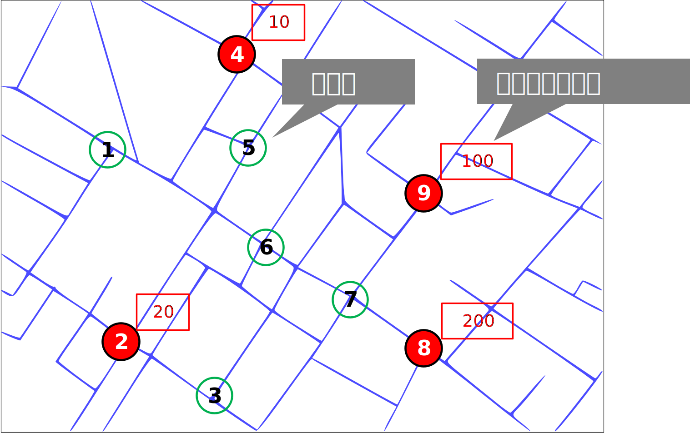

[< 上一页： 3.2. 连续近似方法](chapter3/3.2.continous_approx.md)  &nbsp; |  &nbsp;  [下一页： 3.4. Lagrangian松弛技术](chapter3/3.4.lagrangian_relax.md)

# 3.3. 离散选址模型
上一节介绍了将研究空间的离散的需求连续化来简化建模，但得到的结果不够准确。在这一节我们介绍直接建立混合整数规划模型来刻画问题。如下图所示的平面上有四个客户需求点（红点）以及四个候选供给站点（绿色空心），假设一个牛奶运输企业该如何选择来建立物流配送中心呢？

 
如果按照当前需求量来看的话，选择供给站点7会最大的节约运输成本；如果从未来发展的角度，选择中心供给站点6会最安全；如果预算没有那么紧张，那么尽可能的多选需求量大的客户附近的供给站点将会带来最大的服务质量。因此从不同的角度来看会有不同的选择方式，下面将介绍三个常用的选址模型。
## 3.3.1. 覆盖问题
在选址问题中，向客户提供的服务（由所定位的设施提供）取决于客户与其被分配的设施之间的距离。通常情况下，客户被分配到最近的设施。如果客户与设施的距离在某一给定距离以内，则认为服务可以覆盖（Cover）需求；如果距离超过某个临界值，则认为服务不能覆盖需求。这里我们讨论一种最简单的选址问题模型， **集覆盖**（Set Covering）模型，它的目标是找到一个最小的设施集合，使得所有的需求供给站点都被至少一个设施覆盖。

**符号说明**
- $ N $：站点集合，$ i \in N $ 表示站点 $ i $
- $ M $：需求点集合，$ j \in M $ 表示需求点 $ j $
- $ c_i $：站点 $ i $ 的建设费用
- $ a_{ij} $：是否能够覆盖需求点（需提前计算），定义如下：
  - $ a_{ij} = 1 $，如果站点 $ i $ 可以覆盖需求点 $ j $
  - $ a_{ij} = 0 $，如果站点 $ i $ 不能覆盖需求点 $ j $
- **$ x_i \in \{0, 1\} $：决策变量**，表示是否在站点 $ i $ 建设（1 表示建设，0 表示不建设）

**集覆盖模型**
$$
\begin{align}
\min \quad &\sum_{i \in N} c_i x_i \tag{3.3.1}\\
s.t. \quad &\sum_{i \in N} a_{ij} x_i \geq 1,  &\forall j \in M \tag{3.3.2}\\
&x_i \in \{0, 1\},  &\forall i \in N \tag{3.3.3}
\end{align}
$$

该模型的目标函数3.3.1是最小化建设费用，约束3.3.2确保每个需求点至少被一个站点覆盖。根据这个模型我们可以构建如下算例，试着调整服务范围参数分别为100、70、60并对结果进行比较。
<iframe src="../#/H4sIAAAAAAAACu1Yb1PiRhz2NZ9i5/oiOBecLIjITbkv4thOSFaNA4Qm0WvLOGM9W8HzDntXr6fgv/aqtnMitk75p36Ylt1wr/wKnU1ICCheQWynnTxvQsKyzz6/32+f/RFBFtHQPYPjOG5sbJReYSjIOa/0I+cPhobg6Fgo5A+OBiAcgv4g9NPf3ffCKOZUjVeGOE7jlSgfi82qXcZ96Pv/KFQBJdCIijSUmPemBD6ufZFEEUZWtBmZWRgGvcLnaxQu9YsCzlfJ5gn5dhk/zZJ81eOJyQIfA8KcqslxpKggAlKpcJgNBNkAt8CC1Ng4C0fHWWjc+Dl6F2aD3MJCVyJc2KpXMrjwA0mX9KXK1Xkab6+TvZU/F796n18kp0tX5xmLlk+IkshryOSlM4dZv0EFA6NsGFq8AY6FXLh5ByFkYSjAwmBrFTbt4ub7xUz9MqfXNjvIca3aKFw2ziqUf0pWgAQiALLgo5Z4Ue45sDY/KdXw6l69nKmXf7HF43TRjLiHDjKTyouiHJ31PkjKUkJTH7AgNY8UTRKQGknZS5mQJifgJAvaHvgnWUAjoEpfogjkWCDIMVmJMAoSaU0YHGZgY3wUxQCIdFAajymjhj7XIpqsaoqUmPZKw805g51TtoThahZnS2RvRT++NInoXI9UpCVl1dux7ofBm1Z+e9X6fPphDa8eNSlQQmxPUqtU+s6SrSWXo0lqL5WeU2UvyM5V25NuyYrG5hCzMDzIZDWn/NvJ6li5ka3ra78tXTcky97ScVvJNNKoEkbg40jhmR5dy+cjuz+RzGWnZQl83FIC/eMsoMYAuJGx3k3R4jGt0WaoXzynTvlyTT//mXx36THFKCghIsXbL0u7sPKvZPdVs9yagVORMi8J6FOFT0wjWvQcd1dB+ed4db+x9hTnzqzsUJ/tZt09kuB0Dteqeq5A9lbwygXZKOLsEtkoko2iXltuEvIDJ+RxuWyzXJ2nyZsTvH6A80dOudcsfiDugU8q9eoLklkk+Yy+tWwaiL5UMbaYMCFNgkjHRgpM9ktlhLJertqnlkHCmyQDiagdUH1rWX/3rl5d02tnBguN3OyADsfrUTPORo/1vVkmokQ7gDivzYyonyma95pH+VrHySy9H/7EDx4Cb6dttQ/z02HD5obY1wvfN0rb+kHNppamDN6PIx17T5tBiV4D+Za8Pm47SgyVJuGNFYq/+RpXfjc3Ku9xTkdzPDFL0wz7CbgBe0IUU1GX2bnWoITosa4OK49LSSspCfQkLiX7Nj+r1EiphNfTZOOMbBQbh8s4/ZIc7eOdZ564lHzEi6IiP/EKLGDiUqLX06KT0Iys0508gyxr4Cztk2y9vGi3fY6TPTqQvWpbbfWAbO/qv9VaJguau3VQPmdI6mJwFFHTf6wiuoOkZn4MMXbx0aujFKIsYB5HGBbAPovB6ofMyOF0sVlu99Ncdg+dQxMjQIYFTLTvCrf/yWXfvF/J6qc1vPOsXq5y0HxgaKN8qhybR4NoV8w4ni41Dn9shu+fPlqlKRrBCUZgRkakSfAYcD17tJPqYIns5E1Beu0V2cnjt4f16gvu6jxdL1ch7R2s0c4G/fb+nPnj9T5jdfu3tOb0L0f52NGagw+15z005x1tOXB4+v02sf/265L/HZK8eu9vtG5//2eg8/2fP+S+/3PhwoULFy5cuHDhwoULFy5cuHDh4s74C2V1FEEAKAAA" width="100%" height="600"></iframe>

如果在预算固定的情况下建设设施使用集覆盖模型并不能得到预想的结果，对于这种情况，这里介绍**最大覆盖**（Maximum Covering）模型，它主要用于在有限的资源条件下，以尽可能多地覆盖给定的需求点，从而使总的覆盖效益达到最大化。它在选址、服务规划和资源配置等领域都有广泛应用。

**补充符号**
- $ b_j $：需求点 $ j $ 的需求量
- $ P $：最多可建设的站点数量
- **$ y_j \in \{0, 1\} $：决策变量**，表示需求点 $ j $ 是否被覆盖（1 表示被覆盖，0 表示不被覆盖）

**最大覆盖模型**
$$
\begin{align}
\max \quad &\sum_{j \in M} b_j y_j \tag{3.3.4}\\
s.t.\quad &\sum_{i \in N} x_i \leq P \tag{3.3.5}\\
&\sum_{i \in N} a_{ij} x_i \geq y_j, &\forall j \in M \tag{3.3.6}\\
&x_i \in \{0, 1\}, &\forall i \in N \tag{3.3.7}\\
&y_j \in \{0, 1\}, &\forall j \in M \tag{3.3.8}\\
\end{align}
$$

该模型的目标函数3.3.4是最大化被覆盖的需求量，约束3.3.5限制了建设的站点数量不超过 $ P $，约束3.3.6表示需求点如果被覆盖，必须至少有一个站点覆盖它。

## 3.3.2. 中心问题
如果供给站点对服务距离没有要求，那么所有客户都可以覆盖，我们有P个供给站点的建设费用，那么如何选择这些站点的位置以确保所有需求点都能在尽可能短的最大距离内被服务，从而提高系统的服务效率和公平性？这个问题被称为P中心问题（P-Center Problem）也叫做中心问题。

**补充符号**
- $d_{ij}$：站点 $i$ 与需求点 $j$ 之间的距离
- **$y_{ij}$：决策变量**，表示站点 $i$ 是否为需求点 $j$ 提供服务（0或1）
- **$z$：决策变量**，最大距离，目标是最小化该值

**中心问题模型**
$$
\begin{align}
\min \quad &z \tag{3.3.9}\\
s.t. \quad &\sum_{i \in N} x_i = P \tag{3.3.10}\\
&\sum_{i \in N} y_{ij} = 1,  &\forall j \in M \tag{3.3.11}\\
&\sum_{i \in N} d_{ij} y_{ij} \leq z, &\forall j \in M \tag{3.3.12}\\
&x_i \geq y_{ij}, &\forall i \in N, j \in M \tag{3.3.13}\\
&x_i \in \{0, 1\}, &\forall i \in N \tag{3.3.14}\\
&y_{ij} \in \{0, 1\}, &\forall i \in N, j \in M \tag{3.3.15}\\
\end{align}
$$
该模型目标函数3.3.9为最小化需求点与其服务设施之间的最大距离$z$，这个$z$同时出现在约束3.3.12中，表示$z$至少不小于每个需求点到其服务站点的距离（即最大距离）。约束3.3.10表示可以建设$P$个站点，约束3.3.11表示每个客户需求点 $j$ 只有一个站点为其服务，约束3.3.13表示只有在站点$i$建立时，才能服务需求点$j$。

## 3.3.3. 中位问题
前面的模型都是为了优先保障服务质量，使站点到客户的距离不会太远。如果从节约成本的角度考虑，以降低所有站点到客户的运输费用为目标，我们可以建立中位问题模型（P-Median Problem）如下：

**补充符号**
- $b_j$：需求点 $j$ 的需求量

**中位问题模型**
$$
\begin{align}
\min \quad &\sum_{i \in N} \sum_{j \in M} b_j d_{ij} y_{ij} \tag{3.3.16}\\
s.t. \quad &\sum_{i \in N} x_i = P \tag{3.3.17}\\
&\sum_{i \in N} y_{ij} = 1, &\forall j \in M \tag{3.3.18}\\
&x_i \geq y_{ij}, &\forall i \in N, j \in M \tag{3.3.19}\\
&x_i \in \{0, 1\}, &\forall i \in N \tag{3.3.20}\\
&y_{ij} \in \{0, 1\}, &\forall i \in N, j \in M \tag{3.3.21}\\
\end{align}
$$
目标函数3.3.16为最小化运输总成本，其他的约束与上面的小节中的模型一样。

## 3.3.4. 扩展问题
上面小节中介绍的模型为最基本的离散选址模型，在实际中的情形会非常复杂，通常需要同时考虑多种限制条件，这里我们列出一下常见的扩展模型。

1. **考虑固定建站费用**
在此模型中站点的固定建设成本和运输费用需要同时考虑，通常做法是引入一个折扣系数$\alpha$来结合两部分费用：
$$
\min \sum_{i \in N} c_i x_i + \alpha \sum_{i \in N} \sum_{j \in M} b_j d_{ij} y_{ij}
$$

2. **多级站点选址**
对于大型的物流系统通常需要层级式的管理配送中心，例如省->市->区等级别，不同级别的站点可以在模型中使用下标$k$来区分，例如：
$$
\min \sum_{i \in N} \sum_{j \in M} \sum_{k \in L} b_j^k d_{ij} y_{ij}^k
$$

3. **枢纽选址问题**
对于在物流网络中的点对点运输通常使用枢纽（Hub）节点来集散货物，从而降低运输成本。常见的运输方式为两段式（Hub-and-Spoke），需求点先与最近的枢纽相连，枢纽之间的运输通常享有折扣，如$\alpha, \beta$，该模型的目标函数为：
$$
\min \sum_{j=1}^{m} f_j z_j + \sum_{i=1}^{n} \sum_{j=1}^{m} \alpha c_{ij} d(x_i, y_j) z_j + \sum_{j=1}^{m} \sum_{k=1}^{m} \beta c_{jk} d(y_j, y_k)
$$

4. **选址+分配**
如果客户点与供给站点之间不再是一对一的关系，而是可以一对多或者多对多，那么模型的目标函数为：
$$
\min \sum_{i \in N} \sum_{j \in M} \sum_{k \in L} \sum_{h \in E} b_{ij}^{kh} d_{ij} x_{ij}^{kh}
$$

5. **最大截流**
还有一类选址问题，例如加油站需要选在最繁忙的路段上，即站点截断的流量最大：
$$
\min \sum_{p \in P} f_p y_p
$$

## 3.3.5. 练习
考虑这样一种选址目标：建站成本和运输成本之和最小。约束需满足：
1. 至少建设P个站点
2. 每个客户点至少有一个站点为其服务
3. 每个客户有最小需求，每个站点有最大供应

建立数学模型并求解，注意如果有多个站点为一个客户点服务，那么客户的需求该如何分配？

<iframe src="../#/H4sIAAAAAAAACu2Vy2rbQBSGvfZTDOnCDh2HGcnypaAnCVnI0jRVkCUjTUJbY3DTQuLQkt42aVISCqUXqHuh4MRO/DK15GSVVyhj2XKt5ubQLArn24gZyfOff/7xGd0xWOKGIYSQXC4rnjSvkD+fAimvSAmazeXzipzNKUqCSoqUF7+76cIEyx7X3AQhXHNLmmUteed8d9n7/xRPZzab8xhn9kq6qmtl/qDC1JTj8ntOqjaLpiWTOW52+0dNf6cdbH0NXjzxH28GO+1k0nJ0zUL6ssedMnM9pKJqtVjEsoJlUsOomitgmi1gOhhIRIyKWCG12rlCfvNN76DhN98F663+6sHp4br/9nmwt/ar/uhkpx58Xz09bIxkNdswDY2zUFesXMTSQIrKWVykI12ZYEqKwxGlFNO8jKkyriKSrW+d1Bu97na/sxUT9zvt42b3+OeB0L/ruMhEKqIY3RqbN5ypNzbSD1odf2Ovt9/o7X+OzPvr38IdT4qPwlA1w3BKS+mZimPa3JvBqLrCXG7qzFOrUSnz5sI8XcBoYkJawEjsgGc+ZColGOmO5bhqymWGOBMDjXBjLa3ELITUmORgWihydp+r3PG4a9qLaXN2uKYSX3JszG9v+putYG+t/6UbCom17niMVxwvHav7tnJW5Ref2kym/6Hjb3wcSjDbmAxpfFSunVLkZXtbhDR5VKaOKiooympi5rywStYyS9Vm/2VYwyWvHFas8kFaf9d+UVxnhBX9pcuRk0XGhZOUrpWZq6Wm7FqZTLD7Pmh04y1L18ojJ1QqYCQaAyJzuemb4kgnbI2RQu/omeiUL5/2Dz8Fr7vJ0IzLbIO56euqTBrb/xHsvgqNnd3/K5p34zfaJfe/IH7/Z2W4/wEAAAAAAAAAAAAAAAAAAAAAAAAAAADgyvwGPsYeAAAoAAA=" width="100%" height="600"></iframe>

[< 上一页： 3.2. 连续近似方法](chapter3/3.2.continous_approx.md)  &nbsp; |  &nbsp;  [下一页： 3.4. Lagrangian松弛技术](chapter3/3.4.lagrangian_relax.md)
