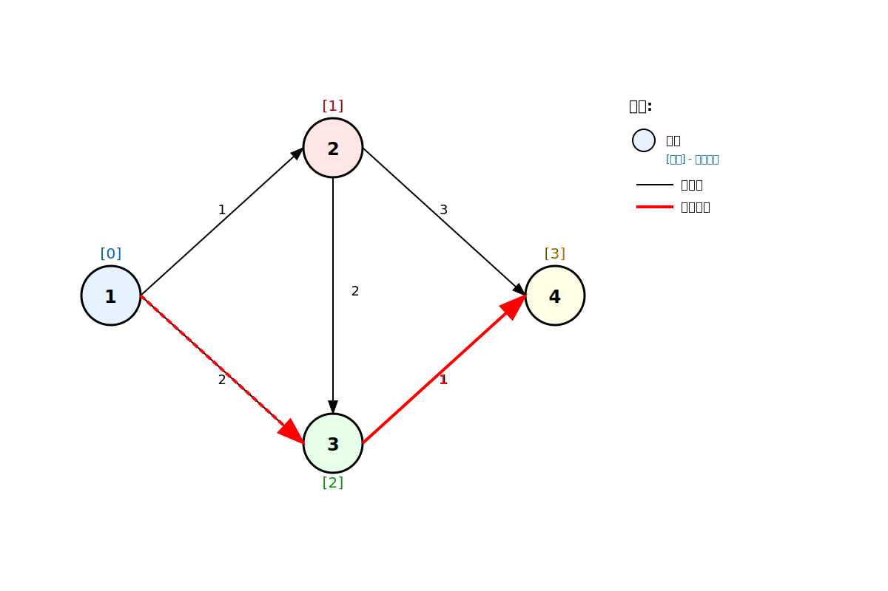
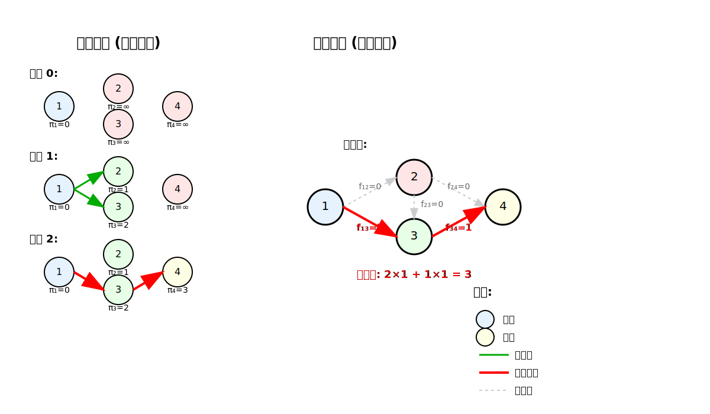

[< 上一页： 4.1. 最短路径问题](chapter4/4.1.shortest_path.md)  &nbsp; |  &nbsp;  [下一页： 4.3. 车辆路径问题 >](chapter4/4.3.vehicle_routing.md)

# 4.2. 标号法及对偶原理
本节介绍标号法求解最短路径问题的基本原理，以及最短路径问题的对偶理论。标号法是一种经典的图论算法，通过为节点分配标号来找到最短路径。我们还将探讨原始-对偶算法的理论基础和实际应用。

## 4.2.1. 标号法的基本思想及图示
标号法（Labeling Algorithm）是求解最短路径问题的一种经典方法。其基本思想是为每个节点分配一个标号，表示从起点到该节点的最短距离。

 
上图展示了标号法的执行过程，其中方括号内的数字表示节点的临时标号，最终确定的标号用圆圈标出。

**标号法的基本步骤：**
1. **初始化**：给起点分配标号0，其他所有节点分配标号∞
2. **选择节点**：选择一个未确定且标号最小的节点作为当前节点
3. **更新标号**：检查当前节点的所有邻接节点，如果通过当前节点能得到更短的路径，则更新邻接节点的标号
4. **确定标号**：将当前节点的标号确定为永久标号
5. **重复**：重复步骤2-4，直到目标节点的标号被确定

## 4.2.2. 最短路径问题的数学模型及其对偶
最短路径问题的对偶理论提供了另一种理解和求解问题的角度。

**原问题（4.1节中的线性规划模型）：**
$$
\begin{align}
\min \quad &\sum_{(i,j) \in E} c_{ij} f_{ij} \tag{4.2.1}\\
s.t. \quad &\sum_{j: (i,j) \in E} f_{ij} - \sum_{j: (j,i) \in E} f_{ji} = b_i, &\forall i \in V \tag{4.2.2}\\
&f_{ij} \geq 0, &\forall (i,j) \in E \tag{4.2.3}
\end{align}
$$

**对偶问题：**
$$
\begin{align}
\max \quad &\sum_{i \in V} b_i \pi_i \tag{4.2.4}\\
s.t. \quad &\pi_i - \pi_j \leq c_{ij}, &\forall (i,j) \in E \tag{4.2.5}\\
&\pi_i \text{ 无约束}, &\forall i \in V \tag{4.2.6}
\end{align}
$$

**符号说明**
- $ \pi_i $：节点 $ i $ 的对偶变量（可以理解为节点标号）
- $ b_i $：节点 $ i $ 的净流量需求
- $ c_{ij} $：边 $ (i,j) $ 的成本

**对偶问题的经济解释：**
对偶变量 $ \pi_i $ 可以理解为从起点到节点 $ i $ 的最短距离标号。约束4.2.5表示任意两个相邻节点的标号差不能超过连接它们的边的成本，这正是最短路径的最优性条件。

## 4.2.3. 原始-对偶算法原理及算例
原始-对偶算法（Primal-Dual Algorithm）同时维护原问题和对偶问题的可行解，通过迭代改进直到达到最优解。

 
上图展示了原始-对偶算法的迭代过程，左侧显示对偶解的更新，右侧显示原始解的构造。

**算法步骤：**
1. **初始化对偶解**：设置 $ \pi_s = 0 $（起点标号为0），$ \pi_i = +\infty $（其他节点标号为无穷大）
2. **构造允许图**：创建满足 $ \pi_i - \pi_j = c_{ij} $ 的边组成的子图
3. **寻找增广路径**：在允许图中寻找从起点到终点的路径
4. **更新对偶解**：如果找不到增广路径，更新对偶变量使更多边进入允许图
5. **更新原始解**：如果找到增广路径，沿路径发送单位流量
6. **重复**：重复步骤2-5，直到找到最短路径

**数字示例（基于4.1节的图）：**

*迭代0：* 初始对偶解
- $ \pi_1 = 0, \pi_2 = \pi_3 = \pi_4 = +\infty $
- 允许图为空

*迭代1：* 更新对偶解
- $ \pi_1 = 0, \pi_2 = 1, \pi_3 = 2, \pi_4 = +\infty $
- 允许边：(1,2)和(1,3)

*迭代2：* 继续更新
- $ \pi_1 = 0, \pi_2 = 1, \pi_3 = 2, \pi_4 = 3 $
- 找到最短路径：1→3→4，总成本为3

## 4.2.4. 练习
1. 使用标号法手工求解4.1节中的最短路径问题，记录每一步的标号更新过程。
2. 验证最优解满足对偶问题的最优性条件。
3. 在MicroCity中实现原始-对偶算法，并与4.1节的结果进行比较。

[< 上一页： 4.1. 最短路径问题](chapter4/4.1.shortest_path.md)  &nbsp; |  &nbsp;  [下一页： 4.3. 车辆路径问题 >](chapter4/4.3.vehicle_routing.md)