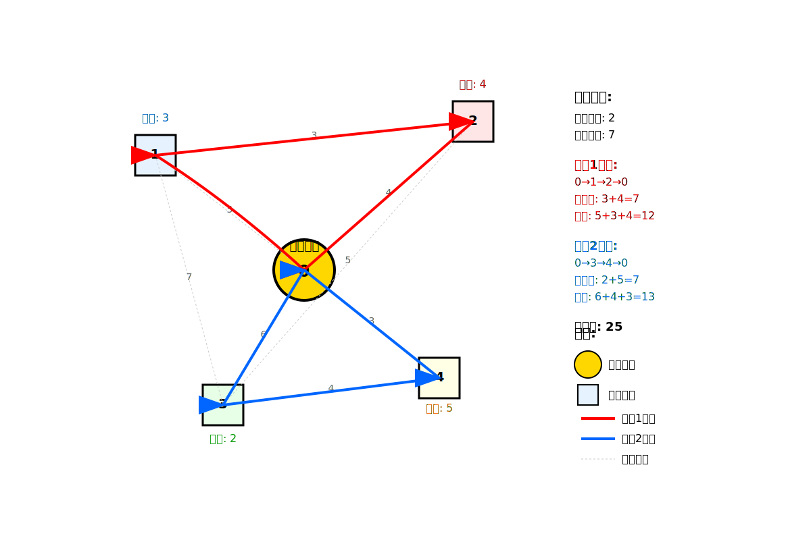
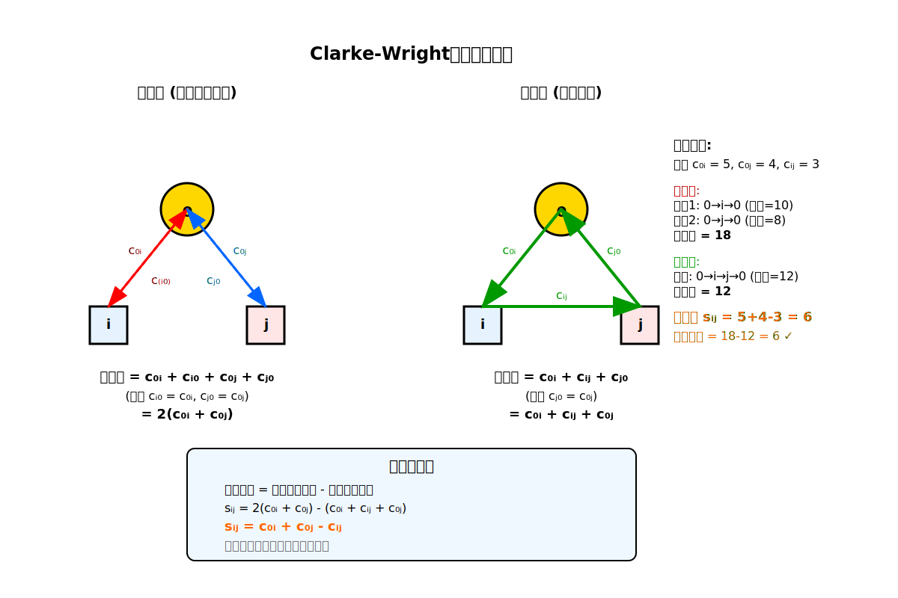

[< 上一页： 4.2. 标号法及对偶原理](chapter4/4.2.labelling_algorithm.md)  &nbsp; |  &nbsp;  [下一页： 4.4. 列生成算法 >](chapter4/4.4.column_generation.md)

# 4.3. 车辆路径问题
本节介绍车辆路径问题（Vehicle Routing Problem, VRP），这是物流运输中最重要的优化问题之一。我们将重点讲解有容量约束的车辆路径问题（CVRP）的数学模型和经典的CW节约算法，并通过示例演示如何使用MicroCity求解。

## 4.3.1. 车辆路径问题背景及分类
车辆路径问题是在给定车辆容量和客户需求的约束下，为一组车辆规划最优配送路径的问题。

 
上图展示了一个典型的CVRP实例，其中圆圈表示配送中心，方块表示客户点，数字表示客户需求量。

**VRP问题的主要分类：**
- **CVRP**（Capacitated VRP）：有容量约束的车辆路径问题
- **VRPTW**（VRP with Time Windows）：带时间窗的车辆路径问题  
- **MDVRP**（Multi-Depot VRP）：多配送中心车辆路径问题
- **VRPPD**（VRP with Pickup and Delivery）：带取送货的车辆路径问题
- **DVRP**（Dynamic VRP）：动态车辆路径问题

**CVRP问题的特点：**
1. 所有车辆从同一个配送中心出发并返回
2. 每个客户只能被一辆车辆服务一次
3. 每辆车的载重量有限制
4. 目标是最小化总配送距离或成本

## 4.3.2. CVRP基本数学模型及其消除子回路变种
CVRP可以建模为整数规划问题。以下是基于车辆-客户分配的经典模型。

**符号说明**
- $ V = \{0, 1, 2, ..., n\} $：节点集合，其中0表示配送中心
- $ C = \{1, 2, ..., n\} $：客户节点集合
- $ K = \{1, 2, ..., m\} $：车辆集合
- $ c_{ij} $：从节点 $ i $ 到节点 $ j $ 的距离或成本
- $ d_i $：客户 $ i $ 的需求量，$ i \in C $
- $ Q $：车辆容量
- **$ x_{ij}^k $：决策变量**，如果车辆 $ k $ 从节点 $ i $ 直接行驶到节点 $ j $，则为1，否则为0

**基本数学模型**
$$
\begin{align}
\min \quad &\sum_{k \in K} \sum_{i \in V} \sum_{j \in V} c_{ij} x_{ij}^k \tag{4.3.1}\\
s.t. \quad &\sum_{k \in K} \sum_{j \in V} x_{ij}^k = 1, &\forall i \in C \tag{4.3.2}\\
&\sum_{j \in V} x_{0j}^k = 1, &\forall k \in K \tag{4.3.3}\\
&\sum_{i \in V} x_{i0}^k = 1, &\forall k \in K \tag{4.3.4}\\
&\sum_{i \in V} x_{ih}^k - \sum_{j \in V} x_{hj}^k = 0, &\forall h \in C, k \in K \tag{4.3.5}\\
&\sum_{i \in C} d_i \sum_{j \in V} x_{ij}^k \leq Q, &\forall k \in K \tag{4.3.6}\\
&x_{ij}^k \in \{0, 1\}, &\forall i,j \in V, k \in K \tag{4.3.7}
\end{align}
$$

**约束解释：**
- 约束4.3.2：每个客户恰好被一辆车服务
- 约束4.3.3-4.3.4：每辆车必须从配送中心出发并返回
- 约束4.3.5：车辆在客户点的流量平衡
- 约束4.3.6：车辆容量约束
- 约束4.3.7：决策变量为二进制

**消除子回路约束（MTZ约束）：**
为了防止形成不包含配送中心的子回路，需要添加以下约束：
$$
\begin{align}
&u_i - u_j + Q \sum_{k \in K} x_{ij}^k \leq Q - d_j, &\forall i,j \in C, i \neq j \tag{4.3.8}\\
&d_i \leq u_i \leq Q, &\forall i \in C \tag{4.3.9}
\end{align}
$$
其中 $ u_i $ 是辅助变量，表示车辆到达客户 $ i $ 时的累计载货量。

## 4.3.3. CVRP启发式算法：CW节约算法
Clarke-Wright节约算法（CW算法）是求解CVRP的经典启发式算法，具有直观的经济意义和良好的计算效率。

 
上图展示了CW算法的节约计算原理：将两个独立路径合并可以节约的距离。

**节约值计算公式：**
$$
s_{ij} = c_{0i} + c_{0j} - c_{ij} \tag{4.3.10}
$$

**算法步骤：**
1. **初始化**：为每个客户创建一条独立的路径（配送中心→客户→配送中心）
2. **计算节约值**：对所有客户对 $ (i,j) $ 计算节约值 $ s_{ij} $
3. **排序**：将所有节约值按降序排列
4. **合并路径**：
   - 按节约值从大到小考虑客户对 $ (i,j) $
   - 如果客户 $ i $ 和 $ j $ 可以合并到同一路径且不违反容量约束，则合并
   - 合并条件：$ i $ 是某路径的末尾客户，$ j $ 是某路径的开始客户
5. **重复**：继续步骤4直到没有可行的合并

**数字示例（基于4.3.1的图）：**

假设配送中心为节点0，客户为节点1,2,3，需求分别为3,4,2，车辆容量为7。

*步骤1：* 初始路径
- 路径1：0→1→0（距离：2×5=10）
- 路径2：0→2→0（距离：2×4=8）  
- 路径3：0→3→0（距离：2×6=12）

*步骤2：* 计算节约值
- $ s_{12} = 5 + 4 - 3 = 6 $
- $ s_{13} = 5 + 6 - 7 = 4 $
- $ s_{23} = 4 + 6 - 5 = 5 $

*步骤3：* 按节约值排序：$ s_{12} > s_{23} > s_{13} $

*步骤4：* 合并路径
- 考虑合并客户1和2：需求3+4=7≤7，可行 → 路径：0→1→2→0
- 考虑合并客户2和3：路径2已被合并，检查0→1→2→3→0，需求3+4+2=9>7，不可行

*最终解：*
- 路径1：0→1→2→0（距离：5+3+4=12）
- 路径2：0→3→0（距离：6+6=12）
- 总距离：24

## 4.3.4. 练习
1. 手工使用CW算法求解4.3.1节中的CVRP实例，记录每一步的节约值计算和路径合并过程。
2. 分析MTZ约束在消除子回路中的作用机制。
3. 在MicroCity中实现CW算法，并与精确算法的结果进行比较。

[< 上一页： 4.2. 标号法及对偶原理](chapter4/4.2.labelling_algorithm.md)  &nbsp; |  &nbsp;  [下一页： 4.4. 列生成算法 >](chapter4/4.4.column_generation.md)