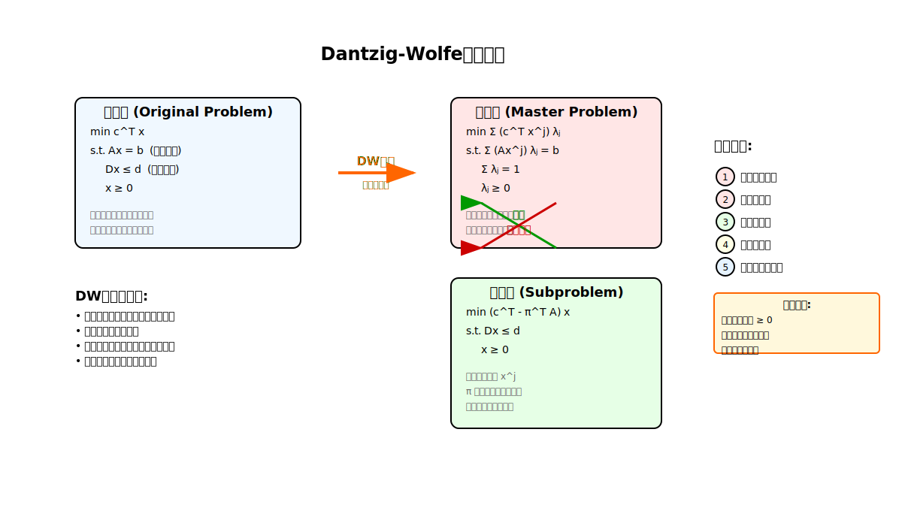
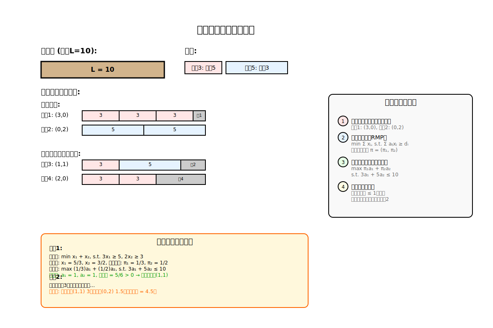

[< 上一页： 4.3. 车辆路径问题](chapter4/4.3.vehicle_routing.md)  &nbsp; |  &nbsp;  [下一页： 4. 运输路径规划 >](chapter4/4.route_planning.md)

# 4.4. 列生成算法
本节介绍列生成算法（Column Generation Algorithm），这是求解大规模线性规划和整数规划问题的重要方法。我们将重点讲解Dantzig-Wolfe分解的基本原理，并通过下料问题和车辆路径问题的示例演示如何使用MicroCity实现列生成算法。

## 4.4.1. Dantzig-Wolfe分解的基本原理及示例
Dantzig-Wolfe分解是一种将大规模线性规划问题分解为主问题和子问题的方法，是列生成算法的理论基础。

 
上图展示了Dantzig-Wolfe分解的基本思想：将原问题分解为主问题（Master Problem）和若干子问题（Subproblem）。

**考虑以下线性规划问题：**
$$
\begin{align}
\min \quad &c^T x \tag{4.4.1}\\
s.t. \quad &Ax = b \tag{4.4.2}\\
&Dx \leq d \tag{4.4.3}\\
&x \geq 0 \tag{4.4.4}
\end{align}
$$

其中约束可以分为两类：
- **连接约束**（4.4.2）：涉及所有变量，难以分解
- **局部约束**（4.4.3）：可以按块结构分解

**Dantzig-Wolfe分解步骤：**
1. **定义可行域**：设 $ S = \{x : Dx \leq d, x \geq 0\} $
2. **极点表示**：可行域 $ S $ 的任意点都可以表示为极点的凸组合
3. **重新表述**：$ x = \sum_{j=1}^{|P|} \lambda_j x^j $，其中 $ x^j $ 是 $ S $ 的极点
4. **主问题**：在 $ \lambda $ 空间求解，子问题负责生成新的极点

**主问题（Restricted Master Problem, RMP）：**
$$
\begin{align}
\min \quad &\sum_{j \in J} (c^T x^j) \lambda_j \tag{4.4.5}\\
s.t. \quad &\sum_{j \in J} (A x^j) \lambda_j = b \tag{4.4.6}\\
&\sum_{j \in J} \lambda_j = 1 \tag{4.4.7}\\
&\lambda_j \geq 0, &\forall j \in J \tag{4.4.8}
\end{align}
$$

**子问题（Pricing Problem）：**
$$
\begin{align}
\min \quad &(c^T - \pi^T A) x \tag{4.4.9}\\
s.t. \quad &Dx \leq d \tag{4.4.10}\\
&x \geq 0 \tag{4.4.11}
\end{align}
$$

其中 $ \pi $ 是主问题约束4.4.6的对偶变量。

## 4.4.2. 列生成算法的基本原理及下料问题示例
列生成算法通过迭代求解主问题和子问题来逐步构造最优解。下料问题是列生成算法的经典应用。

 
上图展示了下料问题的切割模式和列生成过程。

**下料问题描述：**
有一批长度为 $ L $ 的原材料，需要切割成若干段来满足不同长度的需求。

**符号说明**
- $ L $：原材料长度
- $ l_i $：第 $ i $ 种产品的长度，$ i = 1, 2, ..., m $
- $ d_i $：第 $ i $ 种产品的需求量
- $ a_{ij} $：切割模式 $ j $ 中第 $ i $ 种产品的数量
- **$ x_j $：决策变量**，采用切割模式 $ j $ 的原材料数量

**数学模型：**
$$
\begin{align}
\min \quad &\sum_{j=1}^{n} x_j \tag{4.4.12}\\
s.t. \quad &\sum_{j=1}^{n} a_{ij} x_j \geq d_i, &\forall i = 1, ..., m \tag{4.4.13}\\
&x_j \geq 0, &\forall j = 1, ..., n \tag{4.4.14}
\end{align}
$$

**主问题（当前已知的切割模式）：**
$$
\begin{align}
\min \quad &\sum_{j \in J} x_j \tag{4.4.15}\\
s.t. \quad &\sum_{j \in J} a_{ij} x_j \geq d_i, &\forall i = 1, ..., m \tag{4.4.16}\\
&x_j \geq 0, &\forall j \in J \tag{4.4.17}
\end{align}
$$

**子问题（寻找新的切割模式）：**
$$
\begin{align}
\max \quad &\sum_{i=1}^{m} \pi_i a_i \tag{4.4.18}\\
s.t. \quad &\sum_{i=1}^{m} l_i a_i \leq L \tag{4.4.19}\\
&a_i \geq 0, \text{整数}, &\forall i = 1, ..., m \tag{4.4.20}
\end{align}
$$

**数字示例：**
假设原材料长度 $ L = 10 $，需要切割成长度为3和5的产品，需求分别为5和3。

*初始切割模式：*
- 模式1：(3, 0) - 只切3长度的产品，每根可切3段
- 模式2：(0, 2) - 只切5长度的产品，每根可切2段

*列生成迭代：*
1. 求解主问题得到对偶价格 $ \pi_1, \pi_2 $
2. 求解子问题寻找收益最大的新切割模式
3. 如果新模式收益>1，加入主问题；否则停止

## 4.4.3. 车辆路径问题的列生成算法示例
车辆路径问题可以用集合分割模型建模，然后使用列生成算法求解。

 
上图展示了VRP列生成算法中路径的生成和选择过程。

**集合分割模型：**
设 $ \Omega $ 为所有可行路径的集合，$ a_{ir} $ 表示路径 $ r $ 是否访问客户 $ i $。

$$
\begin{align}
\min \quad &\sum_{r \in \Omega} c_r x_r \tag{4.4.21}\\
s.t. \quad &\sum_{r \in \Omega} a_{ir} x_r = 1, &\forall i \in C \tag{4.4.22}\\
&x_r \in \{0, 1\}, &\forall r \in \Omega \tag{4.4.23}
\end{align}
$$

**主问题（当前已知路径）：**
$$
\begin{align}
\min \quad &\sum_{r \in R} c_r x_r \tag{4.4.24}\\
s.t. \quad &\sum_{r \in R} a_{ir} x_r = 1, &\forall i \in C \tag{4.4.25}\\
&x_r \geq 0, &\forall r \in R \tag{4.4.26}
\end{align}
$$

**子问题（最短路径问题）：**
在子问题中，我们需要找到成本最小的可行路径：
$$
\begin{align}
\min \quad &\sum_{(i,j) \in E} (c_{ij} - \pi_i \delta_{ij}) y_{ij} \tag{4.4.27}\\
s.t. \quad &\text{路径可行性约束} \tag{4.4.28}\\
&\text{容量约束} \tag{4.4.29}\\
&y_{ij} \in \{0, 1\}, &\forall (i,j) \in E \tag{4.4.30}
\end{align}
$$

其中 $ \delta_{ij} = 1 $ 如果边 $ (i,j) $ 访问了客户节点。

**算法步骤：**
1. **初始化**：生成一些初始可行路径
2. **求解主问题**：得到当前最优解和对偶价格 $ \pi_i $
3. **求解子问题**：寻找简化成本最小的新路径
4. **检查停止条件**：如果最小简化成本≥0，则停止
5. **添加列**：将新路径加入主问题，返回步骤2

**数字示例（基于4.3.1的图）：**

*初始路径：*
- 路径1：0→1→0（成本=10，覆盖客户{1}）
- 路径2：0→2→0（成本=8，覆盖客户{2}）
- 路径3：0→3→0（成本=12，覆盖客户{3}）
- 路径4：0→4→0（成本=6，覆盖客户{4}）

*第一次迭代：*
- 主问题最优解：x₁=1, x₂=1, x₃=1, x₄=1，目标值=36
- 对偶价格：π₁=10, π₂=8, π₃=12, π₄=6
- 子问题发现新路径：0→1→2→0（简化成本=12-10-8=-6<0）

*最终迭代：*
- 新路径：0→1→2→0（成本=12），0→3→4→0（成本=13）
- 最优解：使用这两条路径，总成本=25

## 4.4.4. 练习
1. 手工执行下料问题的列生成算法，记录每一次迭代的主问题和子问题求解过程。
2. 分析VRP列生成算法中子问题的复杂性，比较不同的子问题求解方法。
3. 在MicroCity中实现列生成算法求解车辆路径问题，并与4.3节的启发式算法结果进行比较。

[< 上一页： 4.3. 车辆路径问题](chapter4/4.3.vehicle_routing.md)  &nbsp; |  &nbsp;  [下一页： 4. 运输路径规划 >](chapter4/4.route_planning.md)