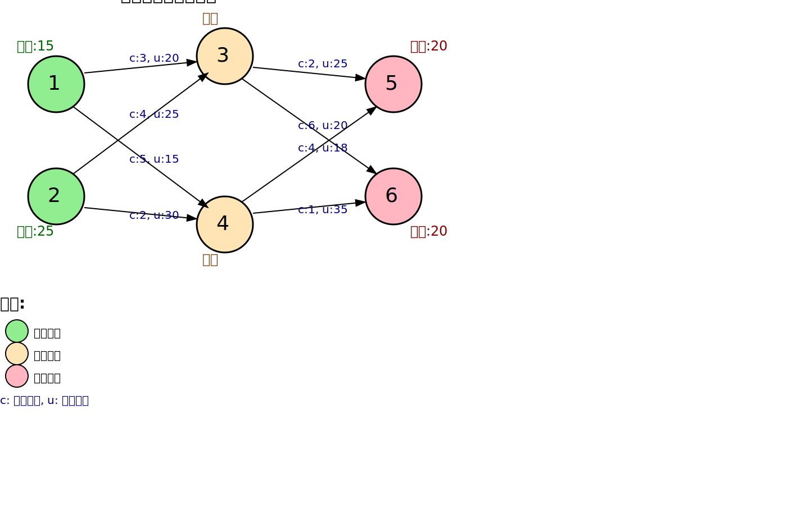

[< 上一页： 5. 网络流量分配](chapter5/5.flow_assignment.md)  &nbsp; |  &nbsp;  [下一页： 5.2. 非线性网络流 >](chapter5/5.2.nonlinear_flow.md)

# 5.1. 最小费用流模型
本节介绍网络流理论中的经典问题——最小费用流模型。这个模型在物流网络中用于寻找满足供需平衡的最经济的流量分配方案，是网络流量分配问题的基础。我们将给出最小费用流问题的数学模型，阐述其与最短路径和最大流问题的关系，并通过示例演示如何使用MicroCity求解。

## 5.1.1. 网络定义及其数学模型
最小费用流问题是在有向图中寻找满足供需约束和容量约束的最小成本流量分配方案。该问题广泛应用于物流运输、生产计划和资源配置等领域。

以下是一个最小费用流网络的示例，展示了供应节点、中转节点、需求节点以及各边的成本和容量信息：

图中绿色节点为供应节点，橙色节点为中转节点，粉色节点为需求节点。边上的标注"c:x, u:y"表示该边的单位成本为x，容量上界为y。

**符号说明**
- $ G = (V, E) $：有向图，$ V $ 为节点集合，$ E $ 为边集合
- $ c_{ij} $：从节点 $ i $ 到节点 $ j $ 的边 $ (i, j) $ 的单位流量成本，$ (i,j) \in E $
- $ u_{ij} $：边 $ (i, j) $ 的容量上界，$ (i,j) \in E $
- $ b_i $：节点 $ i $ 的净流量（供应为正，需求为负），$ i \in V $
- **$ f_{ij} $：决策变量**，边 $ (i, j) $ 上的流量，$ (i,j) \in E $

**线性规划模型**
$$
\begin{align}
\min \quad &\sum_{(i,j) \in E} c_{ij} f_{ij} \tag{5.1.1}\\
s.t. \quad &\sum_{j: (i,j) \in E} f_{ij} - \sum_{j: (j,i) \in E} f_{ji} = b_i, &\forall i \in V \tag{5.1.2}\\
&0 \leq f_{ij} \leq u_{ij}, &\forall (i,j) \in E \tag{5.1.3}\\
&\sum_{i \in V} b_i = 0 \tag{5.1.4}
\end{align}
$$

目标函数5.1.1是最小化网络中所有边的流量加权成本总和。约束5.1.2是流量平衡约束，描述了每个节点流入量与流出量的平衡关系。约束5.1.3限制了每条边的流量不能超过其容量上界。约束5.1.4确保整个网络的总供应量等于总需求量。

## 5.1.2. 最短路径和最大流最小割问题
最小费用流模型是一个通用框架，它包含了许多经典的网络优化问题作为特例。

**最短路径问题**
当网络中只有一个供应节点（$ b_s = 1 $）和一个需求节点（$ b_t = -1 $），其他节点的净流量为0，且所有边的容量足够大时，最小费用流问题退化为最短路径问题。这正是我们在[4.1节](chapter4/4.1.shortest_path.md)中讨论的情况。

**最大流问题**
当所有边的成本为0（$ c_{ij} = 0 $），只有一个供应节点和一个需求节点，且目标是最大化从源点到汇点的流量时，最小费用流问题转化为最大流问题。

**最小割问题**
根据最大流最小割定理，最大流问题的对偶问题是最小割问题，即寻找分离源点和汇点的最小容量割集。

## 5.1.3. 连续最短路径法（残余网络与相对权重）
连续最短路径法是求解最小费用流问题的经典算法之一。该算法的基本思想是在残余网络中反复寻找最短路径，并沿着这些路径增加流量，直到达到最优解。

**残余网络构造**
对于当前流量分配 $ f $，构造残余网络 $ G_f = (V, E_f) $，其中：
- 对于原网络中的边 $ (i,j) \in E $，如果 $ f_{ij} < u_{ij} $，则在残余网络中添加边 $ (i,j) $，剩余容量为 $ u_{ij} - f_{ij} $，成本为 $ c_{ij} $
- 如果 $ f_{ij} > 0 $，则在残余网络中添加反向边 $ (j,i) $，容量为 $ f_{ij} $，成本为 $ -c_{ij} $

以下示例展示了如何从原网络的当前流量分配构造残余网络：

上图显示了原网络中的当前流量分配（上半部分）和对应的残余网络（下半部分）。残余网络中的蓝色实线边表示正向边（剩余容量），红色虚线边表示反向边（可撤销的流量）。

### 算法步骤

1. 初始化：设置所有边的流量为0
2. 在残余网络中寻找从任一供应节点到任一需求节点的最短路径
3. 沿着最短路径增加尽可能多的流量
4. 更新残余网络
5. 重复步骤2-4，直到残余网络中不存在从供应节点到需求节点的路径

**相对权重**
在实际应用中，可以使用相对权重来处理不同类型的成本。例如，可以将运输时间和运输费用通过权重系数组合成综合成本：
$$
c_{ij}^{综合} = w_1 \cdot c_{ij}^{时间} + w_2 \cdot c_{ij}^{费用}
$$
其中 $ w_1 $ 和 $ w_2 $ 分别是时间和费用的权重系数。

## 5.1.4. 练习

在MicroCity中编程求解以下最小费用流问题：

- 构建一个包含6个节点的物流网络
- 节点1和节点2为供应节点，供应量分别为15和25
- 节点5和节点6为需求节点，需求量分别为20和20
- 节点3和节点4为中转节点
- 设置各边的容量和单位运输成本
- 使用最小费用流模型求解最优流量分配方案

[< 上一页： 5. 网络流量分配](chapter5/5.flow_assignment.md)  &nbsp; |  &nbsp;  [下一页： 5.2. 非线性网络流 >](chapter5/5.2.nonlinear_flow.md)
