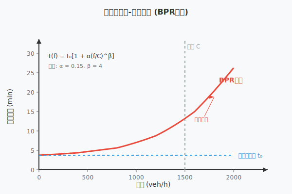
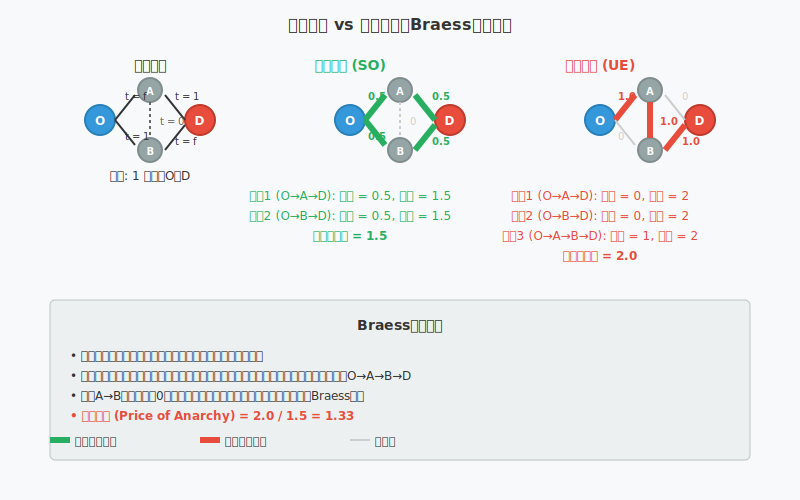
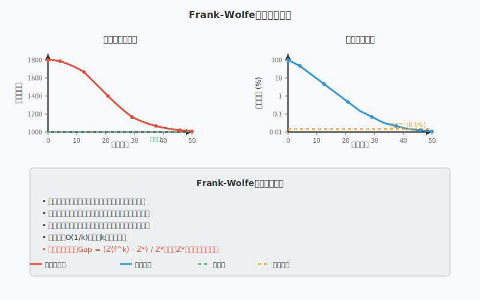

[< 上一页： 5.1. 最小费用流模型](chapter5/5.1.minimum_flow.md)  &nbsp; |  &nbsp;  [下一页： 5.3. Benders分解 >](chapter5/5.3.benders_decomposition.md)

# 5.2. 非线性网络流
本节介绍非线性网络流模型，重点关注交通分配问题中的系统最优和用户最优模型。与线性最小费用流不同，非线性网络流考虑了流量与成本之间的非线性关系，更真实地反映了交通拥堵等现象。我们将介绍Frank-Wolfe算法求解非线性网络流问题，并通过MicroCity的实例演示其应用。

## 5.2.1. 非线性网络流的数学模型
在实际的交通网络中，边的出行时间或成本通常不是常数，而是流量的函数。当流量增加时，由于拥堵效应，出行时间也会相应增加。这种现象可以用非线性函数来描述。



上图展示了典型的流量-时间关系曲线，其中横轴表示边上的流量，纵轴表示出行时间。曲线显示了随着流量增加，出行时间呈非线性增长的特征。

**符号说明**
- $ G = (V, E) $：有向图，$ V $ 为节点集合，$ E $ 为边集合
- $ t_a(f_a) $：边 $ a $ 上的出行时间函数，依赖于该边的流量 $ f_a $
- $ u_a $：边 $ a $ 的容量上界
- $ d^{rs} $：从起点 $ r $ 到终点 $ s $ 的出行需求量
- $ R $：起点集合，$ S $：终点集合
- **$ f_a $：决策变量**，边 $ a $ 上的总流量
- **$ x_k^{rs} $：决策变量**，OD对 $ (r,s) $ 在路径 $ k $ 上的流量

**BPR (Bureau of Public Roads) 函数**
最常用的出行时间函数是BPR函数：
$$
t_a(f_a) = t_a^0 \left[1 + \alpha \left(\frac{f_a}{C_a}\right)^{\beta}\right] \tag{5.2.1}
$$
其中：
- $ t_a^0 $：边 $ a $ 的自由流出行时间
- $ C_a $：边 $ a $ 的容量
- $ \alpha, \beta $：标定参数，通常 $ \alpha = 0.15, \beta = 4 $

## 5.2.2. 交通分配问题以及系统最优和用户最优模型
在交通网络分析中，有两种重要的优化准则：系统最优和用户最优。这两种准则反映了不同的决策视角和目标。

### 系统最优模型 (System Optimal, SO)
系统最优模型追求整个交通系统的总体效益最大化，即最小化所有用户的总出行时间。

**数学模型**
$$
\begin{align}
\min \quad &\sum_{a \in E} \int_0^{f_a} t_a(\omega) d\omega \tag{5.2.2}\\
s.t. \quad &\sum_{k \in K^{rs}} x_k^{rs} = d^{rs}, &\forall r \in R, s \in S \tag{5.2.3}\\
&f_a = \sum_{r \in R} \sum_{s \in S} \sum_{k \in K^{rs}} \delta_{ak}^{rs} x_k^{rs}, &\forall a \in E \tag{5.2.4}\\
&x_k^{rs} \geq 0, &\forall k \in K^{rs}, r \in R, s \in S \tag{5.2.5}
\end{align}
$$

其中 $ \delta_{ak}^{rs} $ 是路径-边关联矩阵元素，如果路径 $ k $ 包含边 $ a $ 则为1，否则为0。

### 用户最优模型 (User Equilibrium, UE)
用户最优模型假设每个用户都选择自己的最短路径，最终达到Wardrop第一平衡原理：对于任意OD对，所有被使用的路径具有相等且最小的出行时间。

**变分不等式表述**
用户最优条件可以表述为以下变分不等式：
$$
\sum_{a \in E} t_a(f_a^*)(f_a - f_a^*) \geq 0, \quad \forall f \in \Omega \tag{5.2.6}
$$
其中 $ \Omega $ 是可行流量集合，$ f^* $ 是用户最优解。

**等价的最小化问题**
当出行时间函数满足一定条件时，用户最优可以等价地表述为：
$$
\begin{align}
\min \quad &\sum_{a \in E} \int_0^{f_a} t_a(\omega) d\omega \tag{5.2.7}\\
s.t. \quad &\text{约束 (5.2.3)-(5.2.5)}
\end{align}
$$



上图展示了在简单网络中系统最优和用户最优解的差异。左侧显示了网络拓扑和需求，右侧比较了两种优化准则下的流量分配结果。

### 效率损失（Price of Anarchy）
用户最优解通常不等于系统最优解，两者之间的差异被称为"无政府状态的代价"或效率损失：
$$
\text{PoA} = \frac{\text{用户最优下的总出行时间}}{\text{系统最优下的总出行时间}} \tag{5.2.8}
$$

## 5.2.3. Frank-Wolfe算法以及算例
Frank-Wolfe算法（也称为条件梯度法）是求解非线性网络流问题的经典算法，特别适用于约束集合为多面体的凸优化问题。

### 算法原理
Frank-Wolfe算法的基本思想是在每次迭代中：
1. 在当前点处计算目标函数的梯度
2. 求解线性化子问题得到搜索方向
3. 进行一维搜索确定步长
4. 更新解并重复上述过程

### 算法步骤

**初始化**
- 设置初始解 $ f^{(0)} $（通常使用全有或全无分配）
- 设置收敛精度 $ \epsilon $ 和迭代计数器 $ n = 0 $

**主循环**
1. **计算梯度**：计算当前流量下的出行时间 $ t_a(f_a^{(n)}) $
2. **求解辅助问题**：求解线性化的最短路径问题
   $$
   \min \sum_{a \in E} t_a(f_a^{(n)}) y_a \tag{5.2.9}
   $$
   得到辅助解 $ y^{(n)} $
3. **计算搜索方向**：$ d^{(n)} = y^{(n)} - f^{(n)} $
4. **一维搜索**：求解
   $$
   \lambda^{(n)} = \arg\min_{0 \leq \lambda \leq 1} \sum_{a \in E} \int_0^{f_a^{(n)} + \lambda d_a^{(n)}} t_a(\omega) d\omega \tag{5.2.10}
   $$
5. **更新解**：$ f^{(n+1)} = f^{(n)} + \lambda^{(n)} d^{(n)} $
6. **检查收敛性**：如果 $ \|f^{(n+1)} - f^{(n)}\| < \epsilon $，停止；否则 $ n = n + 1 $，返回步骤1



上图展示了Frank-Wolfe算法的收敛过程，显示了目标函数值随迭代次数的变化，以及相对间隙（relative gap）的收敛情况。

### 数值算例

考虑一个简单的4节点网络，包含2个OD对：
- OD对 (1,4)：需求量 100
- OD对 (2,4)：需求量 150

网络中有6条边，每条边的BPR函数参数如下表：

| 边 | 自由流时间 | 容量 | α | β |
|---|------------|------|---|---|
| 1→3 | 10 | 100 | 0.15 | 4 |
| 1→4 | 15 | 80 | 0.15 | 4 |
| 2→3 | 12 | 120 | 0.15 | 4 |
| 2→4 | 18 | 90 | 0.15 | 4 |
| 3→4 | 8 | 150 | 0.15 | 4 |

**MicroCity实现示例**
```python
import microcity as mc

# 创建网络
network = mc.Network()

# 添加节点
for i in range(1, 5):
    network.add_node(i)

# 添加边及其BPR函数
edges = [
    (1, 3, 10, 100), (1, 4, 15, 80),
    (2, 3, 12, 120), (2, 4, 18, 90),
    (3, 4, 8, 150)
]

for from_node, to_node, free_time, capacity in edges:
    network.add_edge(from_node, to_node, 
                     free_time=free_time, 
                     capacity=capacity,
                     alpha=0.15, beta=4)

# 添加OD需求
network.add_demand(1, 4, 100)
network.add_demand(2, 4, 150)

# 创建Frank-Wolfe求解器
solver = mc.FrankWolfe(network, max_iter=100, tolerance=1e-6)

# 求解用户最优
ue_solution = solver.solve_user_equilibrium()

# 求解系统最优
so_solution = solver.solve_system_optimal()

# 输出结果
print("用户最优解:")
for edge_id, flow in ue_solution.edge_flows.items():
    print(f"边 {edge_id}: 流量 = {flow:.2f}")

print(f"\n总出行时间 (UE): {ue_solution.total_travel_time:.2f}")
print(f"总出行时间 (SO): {so_solution.total_travel_time:.2f}")
print(f"效率损失: {ue_solution.total_travel_time / so_solution.total_travel_time:.3f}")
```

## 5.2.4. 练习

在MicroCity中编程实现以下练习：

1. **基础练习**：构建一个6节点的交通网络
   - 设置3个起点（节点1,2,3）和2个终点（节点5,6）
   - 节点4作为中转节点
   - 设计合理的OD需求矩阵
   - 使用BPR函数描述各边的出行时间
   - 分别求解系统最优和用户最优解

2. **参数敏感性分析**：
   - 改变BPR函数中的参数α和β值
   - 观察对用户最优解和系统最优解的影响
   - 分析效率损失随参数变化的规律

3. **收敛性分析**：
   - 实现Frank-Wolfe算法
   - 绘制目标函数值和相对间隙的收敛曲线
   - 比较不同初始解对收敛速度的影响

4. **扩展应用**：
   - 考虑多用户类别（如小汽车和货车）
   - 实现考虑时间窗约束的动态交通分配
   - 分析拥堵收费政策对交通流分配的影响

[< 上一页： 5.1. 最小费用流模型](chapter5/5.1.minimum_flow.md)  &nbsp; |  &nbsp;  [下一页： 5.3. Benders分解 >](chapter5/5.3.benders_decomposition.md)