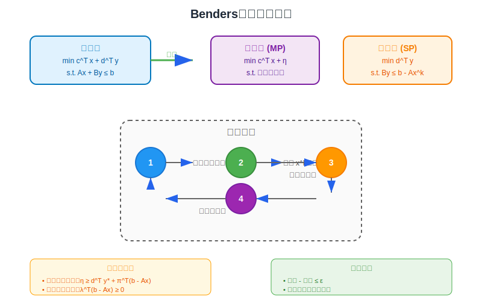
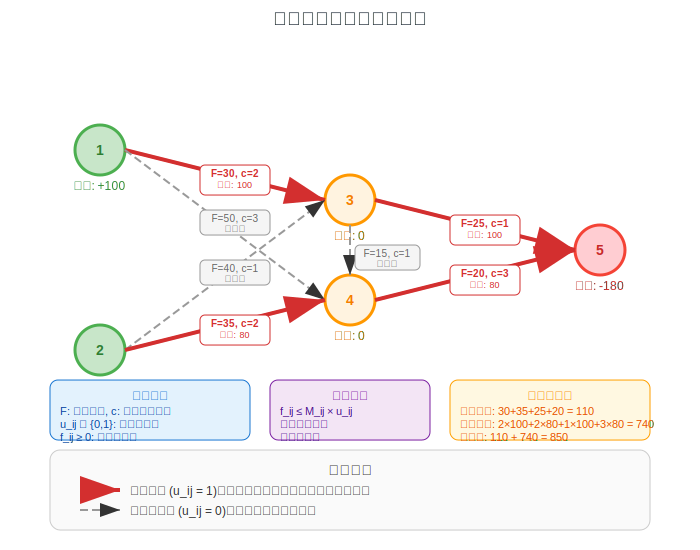

[< 上一页： 5.2. 非线性网络流](chapter5/5.2.nonlinear_flow.md)  &nbsp; |  &nbsp;  [下一页： 5.4. 价格均衡 >](chapter5/5.4.price_equilibrium.md)

# 5.3. Benders分解技术
本节介绍Benders分解方法，这是一种重要的大规模优化算法，特别适用于具有特殊结构的混合整数规划问题。我们将从Fourier-Motzkin消元法开始，介绍线性规划的投影理论基础，然后详细阐述Benders分解的原理和实现，最后通过固定成本网络流问题展示其在运输优化中的应用。

## 5.3.1. Fourier-Motzkin消元法及求解LP问题
Fourier-Motzkin消元法是一种系统化的方法，用于消除线性不等式组中的变量，从而求解线性规划问题或判断其可行性。这一方法为理解Benders分解的投影理论提供了重要基础。

### 基本原理
对于包含变量 $ x_j $ 的线性不等式组，Fourier-Motzkin消元法通过以下步骤消除该变量：

1. **分类不等式**：将所有不等式分为三类
   - $ L^+ $：$ x_j $ 系数为正的不等式
   - $ L^- $：$ x_j $ 系数为负的不等式  
   - $ L^0 $：不包含 $ x_j $ 的不等式

2. **标准化**：将不等式重写为标准形式
   - 对于 $ L^+ $ 中的不等式：$ x_j \geq l_i(\mathbf{x}_{-j}) $
   - 对于 $ L^- $ 中的不等式：$ x_j \leq u_k(\mathbf{x}_{-j}) $

3. **消元组合**：生成新的不等式系统
   $$
   \begin{align}
   &l_i(\mathbf{x}_{-j}) \leq u_k(\mathbf{x}_{-j}), \quad \forall i \in L^+, k \in L^- \tag{5.3.1}\\
   &\text{约束} \in L^0
   \end{align}
   $$

### 线性规划中的应用
考虑线性规划问题：
$$
\begin{align}
\min \quad &\mathbf{c}^T \mathbf{x} \tag{5.3.2}\\
s.t. \quad &\mathbf{A}\mathbf{x} \leq \mathbf{b} \tag{5.3.3}\\
&\mathbf{x} \geq \mathbf{0} \tag{5.3.4}
\end{align}
$$

**算法步骤**
1. **初始化**：选择要消除的变量 $ x_j $
2. **分类约束**：按照变量 $ x_j $ 的系数符号分类
3. **生成新约束**：对每一对 $ (i,k) \in L^+ \times L^- $，生成约束：
   $$
   a_{i,-j}\mathbf{x}_{-j} - a_{kj}\mathbf{x}_{-j} \leq a_{kj}b_i - a_{ij}b_k \tag{5.3.5}
   $$
4. **递归求解**：在降维的问题空间中继续应用消元法

**复杂性分析**
- 时间复杂性：$ O(m^{2^n}) $，其中 $ m $ 是约束数，$ n $ 是变量数
- 空间复杂性：指数级增长，限制了实际应用范围

## 5.3.2. Benders分解原理及行生成
Benders分解是一种基于分解协调的优化方法，特别适用于具有特殊结构的大规模混合整数规划问题。其核心思想是将原问题分解为主问题和子问题，通过迭代求解逐步逼近最优解。

上图展示了Benders分解的基本结构，包括主问题、子问题的关系以及割平面的生成过程。

### 问题结构
考虑具有以下结构的混合整数规划问题：
$$
\begin{align}
\min \quad &\mathbf{c}^T\mathbf{x} + \mathbf{d}^T\mathbf{y} \tag{5.3.6}\\
s.t. \quad &\mathbf{A}\mathbf{x} + \mathbf{B}\mathbf{y} \leq \mathbf{b} \tag{5.3.7}\\
&\mathbf{x} \in X, \mathbf{y} \in Y \tag{5.3.8}
\end{align}
$$

其中：
- $ \mathbf{x} $ 是"困难"变量（通常是整数变量）
- $ \mathbf{y} $ 是"容易"变量（通常是连续变量）
- 固定 $ \mathbf{x} $ 后，关于 $ \mathbf{y} $ 的子问题相对容易求解

### 分解步骤

**步骤1：固定主变量**
固定 $ \mathbf{x} = \mathbf{x}^k $，得到子问题：
$$
\begin{align}
SP(\mathbf{x}^k): \quad \theta(\mathbf{x}^k) = \min \quad &\mathbf{d}^T\mathbf{y} \tag{5.3.9}\\
s.t. \quad &\mathbf{B}\mathbf{y} \leq \mathbf{b} - \mathbf{A}\mathbf{x}^k \tag{5.3.10}\\
&\mathbf{y} \in Y \tag{5.3.11}
\end{align}
$$

**步骤2：分析子问题状态**
子问题可能有三种状态：
1. **最优解存在**：$ \theta(\mathbf{x}^k) $ 有限
2. **无界**：$ \theta(\mathbf{x}^k) = -\infty $
3. **不可行**：$ \theta(\mathbf{x}^k) = +\infty $

**步骤3：生成割平面**
根据线性规划对偶理论：

- **最优性割平面**：当子问题有最优解时
  $$
  \eta \geq \mathbf{d}^T\mathbf{y}^k + (\boldsymbol{\pi}^k)^T(\mathbf{b} - \mathbf{A}\mathbf{x}) \tag{5.3.12}
  $$

- **可行性割平面**：当子问题不可行时
  $$
  (\boldsymbol{\lambda}^k)^T(\mathbf{b} - \mathbf{A}\mathbf{x}) \geq 0 \tag{5.3.13}
  $$

其中 $ \boldsymbol{\pi}^k $ 和 $ \boldsymbol{\lambda}^k $ 分别是对应的对偶最优解和不可行射线。

**步骤4：主问题**
主问题包含所有已生成的割平面：
$$
\begin{align}
MP: \quad \min \quad &\mathbf{c}^T\mathbf{x} + \eta \tag{5.3.14}\\
s.t. \quad &\eta \geq \mathbf{d}^T\mathbf{y}^j + (\boldsymbol{\pi}^j)^T(\mathbf{b} - \mathbf{A}\mathbf{x}), \quad j \in J_{opt} \tag{5.3.15}\\
&(\boldsymbol{\lambda}^j)^T(\mathbf{b} - \mathbf{A}\mathbf{x}) \geq 0, \quad j \in J_{feas} \tag{5.3.16}\\
&\mathbf{x} \in X \tag{5.3.17}
\end{align}
$$

### 算法流程

**初始化**
- 设置 $ J_{opt} = \emptyset, J_{feas} = \emptyset $
- 选择初始解 $ \mathbf{x}^0 $ 或设置 $ LB = -\infty, UB = +\infty $
- 设置迭代计数器 $ k = 0 $ 和收敛容差 $ \epsilon $

**主循环**
1. **求解子问题** $ SP(\mathbf{x}^k) $
2. **状态判断**：
   - 若子问题不可行：添加可行性割平面到 $ J_{feas} $
   - 若子问题无界：输出原问题无界
   - 若子问题最优：更新 $ UB = \min(UB, \mathbf{c}^T\mathbf{x}^k + \theta(\mathbf{x}^k)) $，添加最优性割平面到 $ J_{opt} $
3. **求解主问题** $ MP $，得到 $ (\mathbf{x}^{k+1}, \eta^{k+1}) $
4. **更新下界**：$ LB = \mathbf{c}^T\mathbf{x}^{k+1} + \eta^{k+1} $
5. **收敛检查**：若 $ UB - LB \leq \epsilon $，停止；否则 $ k = k + 1 $，返回步骤1

### 收敛性分析
**收敛性定理**：在有限迭代内，Benders分解算法要么：
1. 证明原问题不可行
2. 证明原问题无界
3. 找到 $ \epsilon $-最优解

**加速技巧**
1. **多重割平面**：每次迭代生成多个割平面
2. **启发式初始解**：使用问题特定的启发式方法
3. **割平面管理**：删除冗余或弱的割平面
4. **分支切割**：结合分支定界方法

## 5.3.3. 固定成本网络流问题的求解
固定成本网络流问题（Fixed Charge Network Flow Problem, FCNF）是Benders分解的经典应用领域。该问题在网络流的基础上考虑了边的固定成本，使得问题具有明显的分解结构。

### 问题描述
固定成本网络流问题可以描述为：在网络中选择使用哪些边，并确定各边上的流量，使得满足需求约束的同时最小化总成本（包括固定成本和变动成本）。

**数学模型**
$$
\begin{align}
\min \quad &\sum_{(i,j) \in E} (f_{ij} c_{ij} + u_{ij} F_{ij}) \tag{5.3.18}\\
s.t. \quad &\sum_{j:(i,j) \in E} f_{ij} - \sum_{j:(j,i) \in E} f_{ji} = b_i, \quad \forall i \in V \tag{5.3.19}\\
&f_{ij} \leq M_{ij} u_{ij}, \quad \forall (i,j) \in E \tag{5.3.20}\\
&f_{ij} \geq 0, u_{ij} \in \{0,1\}, \quad \forall (i,j) \in E \tag{5.3.21}
\end{align}
$$

**符号说明**
- $ f_{ij} $：边 $ (i,j) $ 上的流量（连续变量）
- $ u_{ij} $：边 $ (i,j) $ 是否被使用（二元变量）
- $ c_{ij} $：边 $ (i,j) $ 的单位流量成本
- $ F_{ij} $：边 $ (i,j) $ 的固定成本
- $ M_{ij} $：边 $ (i,j) $ 的容量上界
- $ b_i $：节点 $ i $ 的供需量

上图展示了一个固定成本网络流问题的实例，其中虚线表示可选择的边，实线表示已选择的边，数字表示固定成本和变动成本。

### Benders分解应用

**变量分割**
- 主变量：$ \mathbf{u} = \{u_{ij} : (i,j) \in E\} $（边的选择决策）
- 子变量：$ \mathbf{f} = \{f_{ij} : (i,j) \in E\} $（流量分配）

**子问题**
固定边的选择 $ \mathbf{u}^k $ 后，子问题成为标准的最小费用流问题：
$$
\begin{align}
SP(\mathbf{u}^k): \quad \min \quad &\sum_{(i,j) \in E} c_{ij} f_{ij} \tag{5.3.22}\\
s.t. \quad &\sum_{j:(i,j) \in E} f_{ij} - \sum_{j:(j,i) \in E} f_{ji} = b_i, \quad \forall i \in V \tag{5.3.23}\\
&f_{ij} \leq M_{ij} u_{ij}^k, \quad \forall (i,j) \in E \tag{5.3.24}\\
&f_{ij} \geq 0, \quad \forall (i,j) \in E \tag{5.3.25}
\end{align}
$$

**对偶子问题**
$$
\begin{align}
DSP(\mathbf{u}^k): \quad \max \quad &\sum_{i \in V} b_i \pi_i - \sum_{(i,j) \in E} M_{ij} u_{ij}^k \mu_{ij} \tag{5.3.26}\\
s.t. \quad &\pi_i - \pi_j - \mu_{ij} \leq c_{ij}, \quad \forall (i,j) \in E \tag{5.3.27}\\
&\mu_{ij} \geq 0, \quad \forall (i,j) \in E \tag{5.3.28}
\end{align}
$$

**割平面生成**
- **最优性割平面**：
  $$
  \eta \geq \sum_{i \in V} b_i \pi_i^k - \sum_{(i,j) \in E} M_{ij} u_{ij} \mu_{ij}^k \tag{5.3.29}
  $$

- **可行性割平面**：当子问题不可行时
  $$
  \sum_{i \in V} b_i \lambda_i^k - \sum_{(i,j) \in E} M_{ij} u_{ij} \sigma_{ij}^k \leq 0 \tag{5.3.30}
  $$

**主问题**
$$
\begin{align}
MP: \quad \min \quad &\sum_{(i,j) \in E} F_{ij} u_{ij} + \eta \tag{5.3.31}\\
s.t. \quad &\eta \geq \sum_{i \in V} b_i \pi_i^j - \sum_{(i,j) \in E} M_{ij} u_{ij} \mu_{ij}^j, \quad j \in J_{opt} \tag{5.3.32}\\
&\sum_{i \in V} b_i \lambda_i^j - \sum_{(i,j) \in E} M_{ij} u_{ij} \sigma_{ij}^j \leq 0, \quad j \in J_{feas} \tag{5.3.33}\\
&u_{ij} \in \{0,1\}, \quad \forall (i,j) \in E \tag{5.3.34}
\end{align}
$$

## 5.3.4. 练习

在MicroCity中编程实现以下练习：

1. **Fourier-Motzkin消元法实现**：
   - 实现二维线性规划问题的图形化求解
   - 比较Fourier-Motzkin消元法与单纯形法的计算效率
   - 分析变量数量对算法复杂性的影响

2. **标准Benders分解**：
   - 实现简单的二阶段随机规划问题
   - 比较不同初始解对收敛速度的影响
   - 实现多重割平面生成策略

3. **固定成本网络流扩展**：
   - 考虑多商品固定成本网络流问题
   - 添加节点固定成本（设施选址成本）
   - 实现启发式初始解生成算法

4. **算法改进**：
   - 实现割平面管理策略（删除冗余割平面）
   - 开发加速收敛的启发式方法
   - 比较不同子问题求解器的性能影响

5. **实际应用**：
   - 建模快递配送网络的设施选址问题
   - 考虑不确定需求的鲁棒优化扩展
   - 分析求解规模与计算时间的关系

[< 上一页： 5.2. 非线性网络流](chapter5/5.2.nonlinear_flow.md)  &nbsp; |  &nbsp;  [下一页： 5.4. 价格均衡 >](chapter5/5.4.price_equilibrium.md)