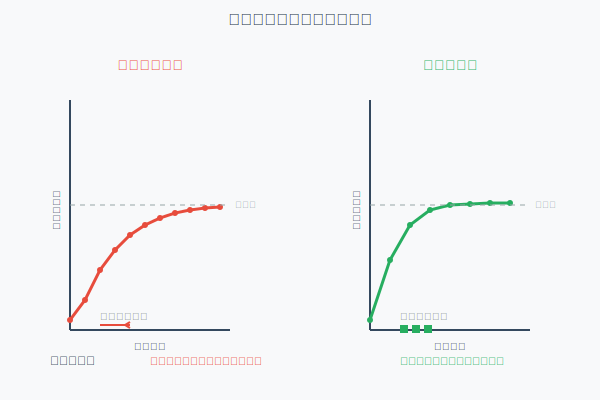
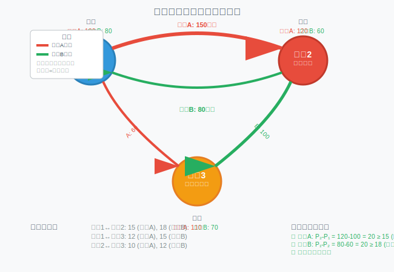

[< 上一页： 5.3. Benders分解技术](chapter5/5.3.benders_decomposition.md)  &nbsp; |  &nbsp;  [下一页： 5. 网络流分配 >](chapter5/5.flow_assignment.md)

# 5.4. 空间价格均衡
本节介绍空间价格均衡模型，这是运输经济学和区域科学中的重要理论工具。我们将从基本的供需均衡理论开始，介绍空间价格均衡的数学模型，探讨求解算法，并分析其在现实经济系统中的应用。空间价格均衡模型能够描述多区域、多商品市场中价格形成和商品流动的规律。

## 5.4.1. 供需均衡与价格形成机制
空间价格均衡理论的核心是理解在地理空间分布的市场中，价格如何通过供需关系和运输成本的相互作用而形成。这一理论为分析区域间贸易、资源配置和政策影响提供了重要框架。

### 基本概念
**空间价格均衡**是指在考虑运输成本的情况下，多个地理区域间商品价格和流量达到的一种稳定状态，此时任何单边的价格或流量调整都不能改善总体福利。

**关键要素**
1. **供给函数**：描述各地区商品供给量与价格的关系
2. **需求函数**：描述各地区商品需求量与价格的关系  
3. **运输成本**：地区间商品流动的单位成本
4. **均衡条件**：价格差不超过运输成本

### 单商品空间均衡模型
考虑 $ n $ 个地区的单一商品市场，设：
- $ p_i $：地区 $ i $ 的商品价格
- $ S_i(p_i) $：地区 $ i $ 的供给函数
- $ D_i(p_i) $：地区 $ i $ 的需求函数
- $ t_{ij} $：从地区 $ i $ 到地区 $ j $ 的单位运输成本
- $ x_{ij} $：从地区 $ i $ 到地区 $ j $ 的商品流量

**均衡条件**
空间价格均衡必须满足以下条件：

1. **供需平衡条件**：
   $$
   S_i(p_i) + \sum_{j \neq i} x_{ji} = D_i(p_i) + \sum_{j \neq i} x_{ij}, \quad \forall i \tag{5.4.1}
   $$

2. **空间套利条件**：
   $$
   \begin{cases}
   p_j - p_i = t_{ij}, & \text{若} \, x_{ij} > 0 \\
   p_j - p_i \leq t_{ij}, & \text{若} \, x_{ij} = 0
   \end{cases} \tag{5.4.2}
   $$

3. **非负性条件**：
   $$
   x_{ij} \geq 0, \quad \forall i,j \tag{5.4.3}
   $$

**经济解释**
- 条件(5.4.1)确保每个地区的供需平衡
- 条件(5.4.2)是无套利条件：如果有商品流动，目的地价格必须恰好等于起点价格加运输成本；如果价格差小于运输成本，则无流动
- 条件(5.4.3)保证流量非负

### 线性供需函数案例
假设线性供需函数：
$$
\begin{align}
S_i(p_i) &= \alpha_i + \beta_i p_i, \quad \beta_i > 0 \tag{5.4.4}\\
D_i(p_i) &= \gamma_i - \delta_i p_i, \quad \delta_i > 0 \tag{5.4.5}
\end{align}
$$

**两地区模型**
对于两个地区的简单情形，设地区1为供给盈余地区，地区2为需求盈余地区。均衡条件简化为：

$$
\begin{align}
S_1(p_1) - D_1(p_1) &= x_{12} \tag{5.4.6}\\
D_2(p_2) - S_2(p_2) &= x_{12} \tag{5.4.7}\\
p_2 - p_1 &= t_{12} \tag{5.4.8}
\end{align}
$$

代入线性函数可得：
$$
p_1^* = \frac{(\alpha_1 - \gamma_1) + (\alpha_2 - \gamma_2) + (\delta_2 + \beta_2)t_{12}}{(\beta_1 + \delta_1) + (\beta_2 + \delta_2)} \tag{5.4.9}
$$

$$
x_{12}^* = \frac{(\alpha_1 - \gamma_1)(\beta_2 + \delta_2) - (\alpha_2 - \gamma_2)(\beta_1 + \delta_1) - (\beta_1 + \delta_1)(\delta_2 + \beta_2)t_{12}}{(\beta_1 + \delta_1) + (\beta_2 + \delta_2)} \tag{5.4.10}
$$

## 5.4.2. 变分不等式模型及求解
空间价格均衡问题可以表述为变分不等式问题，这提供了统一的数学框架和有效的求解方法。变分不等式方法特别适用于处理具有互补松弛条件的均衡问题。

### 变分不等式表述
空间价格均衡问题可以表述为以下变分不等式：

寻找 $ \mathbf{x}^* \in K $ 使得：
$$
F(\mathbf{x}^*)^T(\mathbf{x} - \mathbf{x}^*) \geq 0, \quad \forall \mathbf{x} \in K \tag{5.4.11}
$$

其中：
- $ \mathbf{x} = (x_{ij}) $ 是所有地区间流量组成的向量
- $ K $ 是可行域
- $ F(\mathbf{x}) $ 是映射函数

**映射函数构造**
对于空间价格均衡问题，映射函数的第 $ (i,j) $ 个分量为：
$$
F_{ij}(\mathbf{x}) = p_j(\mathbf{x}) - p_i(\mathbf{x}) - t_{ij} \tag{5.4.12}
$$

其中价格函数通过供需平衡条件确定：
$$
p_i(\mathbf{x}) = S_i^{-1}\left(D_i^{-1}(p_i) + \sum_{j \neq i} x_{ij} - \sum_{j \neq i} x_{ji}\right) \tag{5.4.13}
$$

**可行域**
$$
K = \{\mathbf{x} : x_{ij} \geq 0, \forall i,j\} \tag{5.4.14}
$$

### 投影梯度算法
投影梯度算法是求解变分不等式的基本方法之一，其基本思想是在负梯度方向上移动，然后投影到可行域上。

**算法步骤**
1. **初始化**：选择初始点 $ \mathbf{x}^0 \in K $，设置步长 $ \alpha > 0 $
2. **梯度计算**：计算 $ F(\mathbf{x}^k) $
3. **更新**：$ \mathbf{x}^{k+1} = P_K[\mathbf{x}^k - \alpha F(\mathbf{x}^k)] $
4. **收敛检查**：若 $ \|\mathbf{x}^{k+1} - \mathbf{x}^k\| < \epsilon $，停止；否则 $ k = k+1 $

**投影操作**
对于非负约束，投影操作简单：
$$
P_K[\mathbf{y}]_{ij} = \max(0, y_{ij}) \tag{5.4.15}
$$

### 对角化算法（Diagonalization Algorithm）
对角化算法是专门为空间价格均衡问题设计的分解算法，它将多地区问题分解为多个单地区优化子问题。

**基本思想**
固定其他地区间流量，优化每个地区的净流出量。

**算法步骤**
1. **初始化**：设置初始流量 $ \mathbf{x}^0 $
2. **对每个地区 $ i $**：
   - 固定 $ x_{kl}^k, k \neq i \text{ 或 } l \neq i $
   - 求解子问题：
     $$
     \min_{x_{ij}, x_{ji} \geq 0} \int_0^{net_i} p_i^{-1}(\tau) d\tau + \sum_{j \neq i} t_{ij} x_{ij} \tag{5.4.16}
     $$
     其中 $ net_i = \sum_{j \neq i} x_{ij} - \sum_{j \neq i} x_{ji} $

3. **更新**：用新的解更新流量
4. **收敛检查**：检查是否满足收敛条件

**收敛性质**
- 在单调性条件下算法收敛
- 收敛速度通常比投影梯度算法快
- 特别适用于大规模稀疏网络

上图展示了投影梯度算法和对角化算法的迭代过程及收敛性比较。

## 5.4.3. 多商品空间均衡模型
现实中的区域贸易往往涉及多种商品的同时交换，商品间可能存在替代或互补关系。多商品空间均衡模型扩展了单商品模型，能够更好地描述复杂的经济现象。

### 模型建立
考虑 $ n $ 个地区和 $ m $ 种商品的多商品空间均衡模型。

**符号定义**
- $ p_i^c $：地区 $ i $ 商品 $ c $ 的价格
- $ \mathbf{p}_i = (p_i^1, \ldots, p_i^m) $：地区 $ i $ 的价格向量
- $ S_i^c(\mathbf{p}_i) $：地区 $ i $ 商品 $ c $ 的供给函数
- $ D_i^c(\mathbf{p}_i) $：地区 $ i $ 商品 $ c $ 的需求函数
- $ x_{ij}^c $：从地区 $ i $ 到地区 $ j $ 商品 $ c $ 的流量
- $ t_{ij}^c $：商品 $ c $ 从地区 $ i $ 到地区 $ j $ 的运输成本

**均衡条件**
1. **供需平衡**：
   $$
   S_i^c(\mathbf{p}_i) + \sum_{j \neq i} x_{ji}^c = D_i^c(\mathbf{p}_i) + \sum_{j \neq i} x_{ij}^c, \quad \forall i,c \tag{5.4.17}
   $$

2. **空间套利条件**：
   $$
   \begin{cases}
   p_j^c - p_i^c = t_{ij}^c, & \text{若} \, x_{ij}^c > 0 \\
   p_j^c - p_i^c \leq t_{ij}^c, & \text{若} \, x_{ij}^c = 0
   \end{cases} \tag{5.4.18}
   $$

3. **非负性**：
   $$
   x_{ij}^c \geq 0, \quad \forall i,j,c \tag{5.4.19}
   $$

### 交叉价格效应
多商品模型的关键特征是商品间的交叉价格效应：

**替代品效应**：
$$
\frac{\partial D_i^c(\mathbf{p}_i)}{\partial p_i^{c'}} > 0, \quad c \neq c' \tag{5.4.20}
$$

**互补品效应**：
$$
\frac{\partial D_i^c(\mathbf{p}_i)}{\partial p_i^{c'}} < 0, \quad c \neq c' \tag{5.4.21}
$$

### CES需求函数
常用的多商品需求函数是CES（Constant Elasticity of Substitution）形式：

$$
D_i^c(\mathbf{p}_i) = \frac{I_i (p_i^c)^{-\sigma}}{\sum_{k=1}^m (p_i^k)^{1-\sigma}}, \quad \sigma > 0 \tag{5.4.22}
$$

其中：
- $ I_i $ 是地区 $ i $ 的收入
- $ \sigma $ 是替代弹性参数

**特殊情况**
- $ \sigma = 1 $：Cobb-Douglas偏好
- $ \sigma \to \infty $：完全替代
- $ \sigma \to 0 $：Leontief偏好（固定比例）

### 求解算法扩展
多商品问题的求解可以采用块坐标下降方法：

**商品分解**
固定其他商品的流量，逐个优化每种商品的空间分布：

$$
\min_{x^c} \sum_{i,j} \int_0^{x_{ij}^c} (p_j^c(\tau) - p_i^c(\tau)) d\tau + \sum_{i,j} t_{ij}^c x_{ij}^c \tag{5.4.23}
$$

**地区分解**
固定其他地区的流量，逐个优化每个地区的进出口组合：

$$
\min_{\mathbf{x}_i} \sum_c \int_0^{net_i^c} (p_i^c)^{-1}(\tau) d\tau + \sum_{j,c} t_{ij}^c x_{ij}^c \tag{5.4.24}
$$

上图展示了三地区两商品的空间均衡网络，箭头粗细表示流量大小，颜色表示不同商品。

## 5.4.4. 动态价格均衡与收敛分析
现实中的价格调整是一个动态过程，理解这一过程的收敛性质对于政策制定和市场预测具有重要意义。本节介绍动态价格调整机制及其稳定性分析。

### 动态调整机制
价格的动态调整可以用以下微分方程组描述：

**Walras调整机制**（速度与超额需求成正比）：
$$
\frac{dp_i^c}{dt} = \lambda_i^c \left[D_i^c(\mathbf{p}_i(t)) - S_i^c(\mathbf{p}_i(t)) + \sum_{j \neq i} x_{ji}^c(t) - \sum_{j \neq i} x_{ij}^c(t)\right] \tag{5.4.25}
$$

其中 $ \lambda_i^c > 0 $ 是调整速度参数。

**Marshall调整机制**（流量与价格差成正比）：
$$
\frac{dx_{ij}^c}{dt} = \mu_{ij}^c \left[p_j^c(t) - p_i^c(t) - t_{ij}^c\right]^+ \tag{5.4.26}
$$

其中 $ \mu_{ij}^c > 0 $ 是调整速度参数，$ [z]^+ = \max(0,z) $。

### 稳定性分析
**Lyapunov函数方法**
定义Lyapunov函数：
$$
V(\mathbf{p}, \mathbf{x}) = \sum_{i,c} \int_{p_i^{c*}}^{p_i^c} [D_i^c(\tau) - S_i^c(\tau)] d\tau + \frac{1}{2}\sum_{i,j,c} \mu_{ij}^c (x_{ij}^c - x_{ij}^{c*})^2 \tag{5.4.27}
$$

其中 $ (\mathbf{p}^*, \mathbf{x}^*) $ 是均衡点。

**稳定性定理**
若供给函数递增、需求函数递减，则动态系统全局渐近稳定收敛到唯一均衡点。

**证明要点**
1. $ V(\mathbf{p}^*, \mathbf{x}^*) = 0 $，$ V(\mathbf{p}, \mathbf{x}) > 0 $ 当 $ (\mathbf{p}, \mathbf{x}) \neq (\mathbf{p}^*, \mathbf{x}^*) $
2. $ \frac{dV}{dt} \leq 0 $ 沿系统轨迹
3. 应用LaSalle不变性原理

### 收敛速度分析
**线性化分析**
在均衡点附近线性化动态系统：
$$
\frac{d}{dt}\begin{pmatrix} \Delta \mathbf{p} \\ \Delta \mathbf{x} \end{pmatrix} = \mathbf{J} \begin{pmatrix} \Delta \mathbf{p} \\ \Delta \mathbf{x} \end{pmatrix} \tag{5.4.28}
$$

其中 $ \mathbf{J} $ 是Jacobian矩阵。

**收敛率**
收敛率由Jacobian矩阵的最大实特征值决定：
$$
\text{收敛率} = -\max\{\text{Re}(\lambda) : \lambda \text{ 是 } \mathbf{J} \text{ 的特征值}\} \tag{5.4.29}
$$

### 数值求解方法
**显式Euler方法**：
$$
\begin{align}
p_i^{c,k+1} &= p_i^{c,k} + \Delta t \cdot \lambda_i^c \cdot ED_i^{c,k} \tag{5.4.30}\\
x_{ij}^{c,k+1} &= \max(0, x_{ij}^{c,k} + \Delta t \cdot \mu_{ij}^c \cdot (p_j^{c,k} - p_i^{c,k} - t_{ij}^c)) \tag{5.4.31}
\end{align}
$$

**隐式方法**（提高稳定性）：
使用Newton-Raphson方法求解每个时间步的非线性方程组。

**自适应步长**：
根据局部截断误差动态调整时间步长：
$$
\Delta t^{k+1} = \Delta t^k \cdot \min\left(2, \frac{\epsilon}{\|\text{误差}^k\|}\right) \tag{5.4.32}
$$

上图展示了两地区系统中价格的动态调整轨迹，从初始的非均衡状态逐渐收敛到均衡点。

## 5.4.5. 练习

在MicroCity中编程实现以下练习：

1. **基本空间均衡求解**：
   - 实现两地区线性供需函数的解析解
   - 比较不同运输成本对均衡价格和流量的影响
   - 分析供需弹性参数的敏感性

2. **变分不等式求解器**：
   - 实现投影梯度算法
   - 实现对角化算法并比较收敛性能
   - 开发自适应步长策略

3. **多商品均衡模型**：
   - 建立三地区两商品的CES需求模型
   - 分析替代弹性参数对贸易流量的影响
   - 实现块坐标下降求解算法

4. **动态均衡仿真**：
   - 实现Walras和Marshall调整机制
   - 分析不同初始条件下的收敛轨迹
   - 研究调整速度参数对收敛性的影响

5. **实际应用建模**：
   - 建模农产品的区域贸易均衡
   - 考虑运输能力约束的修正模型
   - 分析贸易政策（关税、补贴）的影响

6. **算法优化**：
   - 实现并行化的多商品求解算法
   - 开发基于机器学习的收敛加速方法
   - 比较不同数值方法的计算效率

[< 上一页： 5.3. Benders分解技术](chapter5/5.3.benders_decomposition.md)  &nbsp; |  &nbsp;  [下一页： 5. 网络流分配 >](chapter5/5.flow_assignment.md)