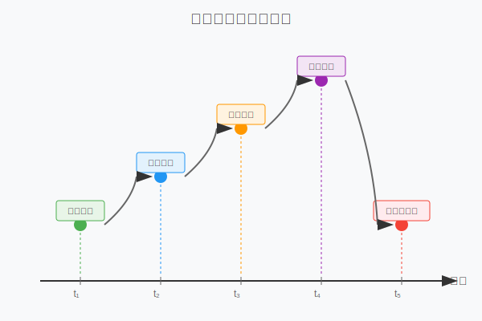
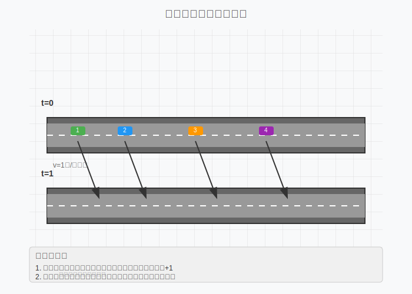
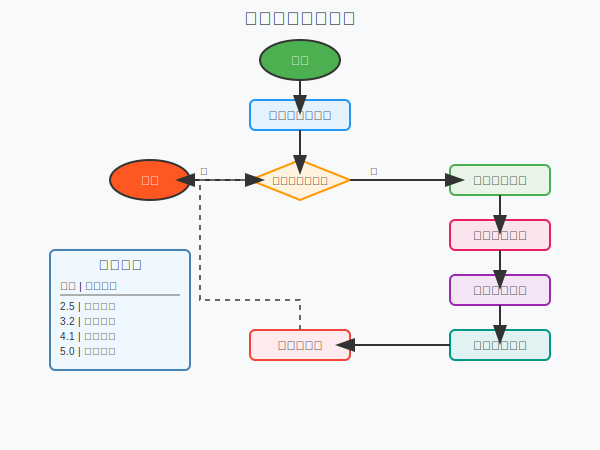
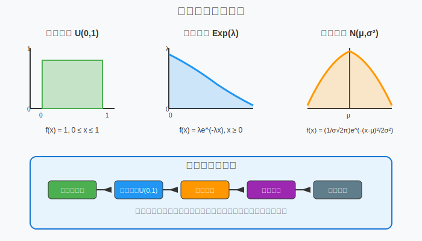

[< 上一页： 6. 动态系统建模](chapter6/6.dynamical_system.md)  &nbsp; |  &nbsp;  [下一页： 6.2. 动态规划算法 >](chapter6/6.2.dynamic_programming.md)

# 6.1. 离散事件仿真
本节介绍离散事件仿真（Discrete Event Simulation）技术，这是分析和建模复杂物流系统动态行为的重要方法。离散事件仿真通过模拟系统中事件的发生和状态变化，帮助我们理解系统性能、识别瓶颈并优化资源配置。我们将介绍时间扫描法和元胞自动机的基本原理，阐述事件调度法的实现机制，并讨论输入输出分析与随机数生成技术。

## 6.1.1. 时间扫描法以及元胞自动机
离散事件仿真中的时间推进机制是核心组成部分。时间扫描法按照固定的时间步长推进仿真时钟，在每个时间点检查和处理可能发生的事件。

以下示例展示了离散事件系统中事件按时间顺序发生的过程：

图中展示了一个物流配送过程中的典型事件序列：车辆到达、开始装货、完成装货、车辆出发和到达目的地。每个事件都在特定时间点发生，并可能触发系统状态的改变和新事件的产生。

**时间扫描法的基本步骤**
1. 初始化仿真时钟 t = 0
2. 设定固定时间步长 Δt
3. 在每个时间点 t 检查是否有事件发生
4. 处理当前时间点的所有事件
5. 更新系统状态
6. 时钟推进：t = t + Δt
7. 重复步骤3-6直到仿真结束

**元胞自动机模型**
元胞自动机（Cellular Automata）是一种特殊的离散时间、离散空间动力学模型，在交通流仿真中有广泛应用。每个元胞代表道路上的一个空间单元，可以是空的或被一辆车占据。

上图展示了一维元胞自动机交通流模型的基本原理。道路被离散化为若干格子，每个格子在某一时刻要么为空，要么被一辆车占据。车辆按照简单的规则在网格中移动：

**基本更新规则**
- **加速**：如果前方没有车辆且当前速度小于最大速度，则速度增加1
- **减速**：如果前方车距小于当前速度，则调整速度以避免碰撞
- **移动**：根据当前速度向前移动相应的格子数

这种模型能够重现交通流的许多复杂现象，如自由流、同步流和宽移动堵塞等。

## 6.1.2. 事件调度法
事件调度法是离散事件仿真的另一种重要时间推进机制。与时间扫描法不同，事件调度法直接从一个事件跳转到下一个事件，避免了检查空闲时间段的开销。

事件调度法的核心是维护一个按时间排序的事件列表（Event List），也称为未来事件集（Future Event Set）。算法的执行流程如下：

**算法步骤**
1. **初始化**：创建空的事件列表，插入初始事件
2. **事件选择**：从事件列表中取出时间最早的事件
3. **时钟更新**：将仿真时钟设置为当前事件的发生时间
4. **事件处理**：执行当前事件的处理逻辑
5. **状态更新**：根据事件处理结果更新系统状态
6. **事件生成**：根据需要在事件列表中插入新的未来事件
7. **循环**：返回步骤2，直到事件列表为空或达到仿真终止条件

**事件类型设计**
在物流系统仿真中，常见的事件类型包括：
- **到达事件**：车辆、货物或订单到达
- **服务开始事件**：开始装货、卸货或处理
- **服务完成事件**：完成装货、卸货或处理
- **离开事件**：车辆或货物离开系统
- **故障事件**：设备故障或异常情况
- **维护事件**：设备维护或检修

每种事件类型都有相应的处理函数，定义了事件发生时系统状态的变化规则和可能产生的新事件。

## 6.1.3. IO分析与随机数
输入输出分析是仿真研究的重要组成部分，涉及输入数据的收集与建模、随机数的生成以及输出结果的统计分析。

**输入建模**
仿真模型的输入通常包含随机性，需要用概率分布来描述：
- **到达间隔时间**：常用指数分布 Exp(λ) 建模
- **服务时间**：可用正态分布 N(μ,σ²) 或对数正态分布建模
- **需求量**：可用泊松分布或正态分布建模
- **故障间隔时间**：常用威布尔分布建模

**随机数生成**
仿真中使用的随机数通常通过以下步骤生成：
1. **基础随机数**：使用线性同余法等算法生成伪随机数
2. **均匀分布**：将基础随机数转换为[0,1]区间的均匀分布随机数
3. **目标分布**：使用逆变换法、舍选法等方法转换为目标概率分布

**逆变换法示例**
对于累积分布函数 F(x)，其逆函数为 F⁻¹(u)。给定均匀分布随机数 u ∈ [0,1]，则 x = F⁻¹(u) 服从分布 F。

指数分布的逆变换：
$$
F(x) = 1 - e^{-\lambda x} \Rightarrow x = -\frac{1}{\lambda}\ln(1-u)
$$

**输出分析**
仿真输出分析包括：
- **点估计**：计算性能指标的均值、方差等统计量
- **置信区间**：估计性能指标的置信区间
- **假设检验**：比较不同系统配置的性能差异
- **灵敏度分析**：分析输入参数变化对输出的影响

**稳态分析与瞬态分析**
- **瞬态期**：系统从初始状态到稳定状态的过渡期
- **稳态期**：系统达到统计稳定的时期
- **预热期删除**：删除瞬态期数据，只分析稳态期数据

## 6.1.4. 练习

在MicroCity中编程实现以下离散事件仿真案例：

**案例：配送中心仿真**
- 建立一个包含2个装货台的配送中心模型
- 车辆到达间隔服从指数分布，平均间隔为10分钟
- 每个装货台的服务时间服从正态分布，均值15分钟，标准差3分钟
- 使用事件调度法实现仿真逻辑
- 分析系统的平均等待时间、服务台利用率和队列长度
- 比较不同到达率下的系统性能

**编程要求**
1. 实现基本的事件类和事件调度器
2. 使用适当的随机数生成方法
3. 收集并分析仿真统计数据
4. 绘制性能指标随时间变化的图表
5. 进行多次独立仿真运行并计算置信区间

[< 上一页： 6. 动态系统建模](chapter6/6.dynamical_system.md)  &nbsp; |  &nbsp;  [下一页： 6.2. 动态规划算法 >](chapter6/6.2.dynamic_programming.md)