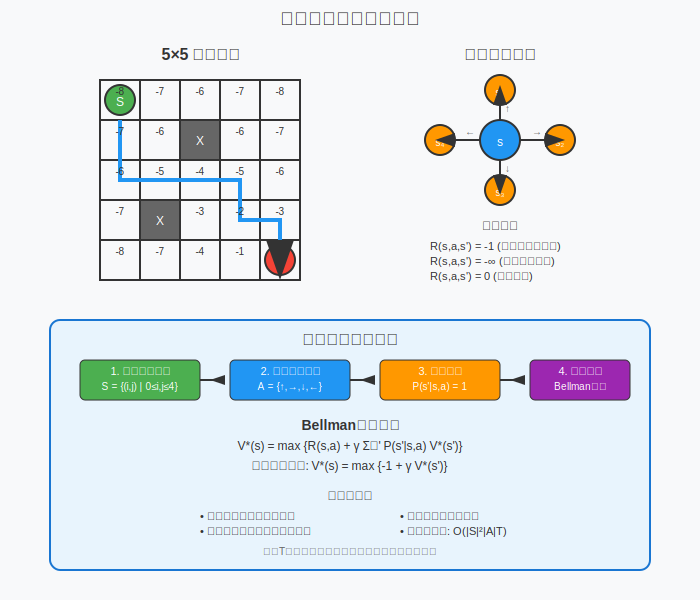

[< 上一页： 6.1. 离散事件仿真](chapter6/6.1.discrete_event_simulation.md)  &nbsp; |  &nbsp;  [下一页： 6.3. 蒙特卡洛采样 >](chapter6/6.3.monte_carlo.md)

# 6.2. 动态规划算法
本节介绍动态规划（Dynamic Programming）在决策优化问题中的应用。动态规划是求解多阶段决策问题的重要方法，通过将复杂问题分解为子问题，利用最优子结构性质和重叠子问题特征，高效地求解最优策略。我们将详细阐述策略迭代和价值迭代两种经典算法，并通过网格世界最短路径问题演示动态规划在物流路径规划中的具体应用。

## 6.2.1. 策略迭代算法
策略迭代（Policy Iteration）是动态规划中的经典算法，通过交替进行策略评估和策略改进来寻找最优策略。该算法基于一个重要观察：任何策略都可以通过评估其价值函数来改进，直到收敛到最优策略。

动态规划算法的核心在于两个基本性质：**最优子结构**和**重叠子问题**。最优子结构保证问题的最优解包含子问题的最优解，而重叠子问题意味着相同的子问题会被多次求解，通过存储已计算的结果可以避免重复计算。

**马尔可夫决策过程模型**
策略迭代算法适用于马尔可夫决策过程（MDP），其数学模型包括：
- **状态空间** $ S $：系统可能处于的所有状态集合
- **动作空间** $ A $：在每个状态下可执行的动作集合
- **转移概率** $ P(s'|s,a) $：在状态 $ s $ 执行动作 $ a $ 后转移到状态 $ s' $ 的概率
- **奖励函数** $ R(s,a,s') $：状态转移的即时奖励
- **折扣因子** $ \gamma \in [0,1) $：未来奖励的折扣系数

**算法步骤**
策略迭代算法包含两个交替进行的步骤：

1. **策略评估（Policy Evaluation）**
   给定策略 $ \pi $，求解线性方程组计算状态价值函数：
   $$
   V^{\pi}(s) = \sum_{a} \pi(a|s) \sum_{s'} P(s'|s,a)[R(s,a,s') + \gamma V^{\pi}(s')]
   $$
   
   这是一个包含 $ |S| $ 个方程的线性方程组，可以通过直接求解或迭代方法得到精确解。

2. **策略改进（Policy Improvement）**
   基于当前价值函数，使用贪婪策略更新策略：
   $$
   \pi'(s) = \arg\max_{a} \sum_{s'} P(s'|s,a)[R(s,a,s') + \gamma V^{\pi}(s')]
   $$
   
   这一步保证新策略 $ \pi' $ 不劣于原策略 $ \pi $，即 $ V^{\pi'}(s) \geq V^{\pi}(s) $ 对所有状态成立。

**收敛性质**
策略迭代算法具有以下重要性质：
- **单调改进**：每次迭代得到的策略都不劣于前一个策略
- **有限收敛**：在有限状态空间中，算法必在有限步内收敛到最优策略
- **确定性策略**：每次迭代都产生确定性策略，便于实际应用

## 6.2.2. 价值迭代算法
价值迭代（Value Iteration）是另一种重要的动态规划算法，直接迭代价值函数而不需要维护显式的策略。该算法基于Bellman最优方程，通过不断更新价值函数直到收敛。

**Bellman最优方程**
价值迭代算法基于Bellman最优方程：
$$
V^*(s) = \max_{a} \sum_{s'} P(s'|s,a)[R(s,a,s') + \gamma V^*(s')]
$$

这个方程表明，最优价值函数满足：在每个状态下选择使期望回报最大的动作所得到的价值。

**算法实现**
价值迭代算法的具体步骤如下：

1. **初始化**：设置 $ V_0(s) = 0 $ 对所有状态 $ s $
2. **价值更新**：对于 $ k = 0, 1, 2, \ldots $，更新：
   $$
   V_{k+1}(s) = \max_{a} \sum_{s'} P(s'|s,a)[R(s,a,s') + \gamma V_k(s')]
   $$
3. **收敛判断**：当 $ \|V_{k+1} - V_k\|_{\infty} < \varepsilon $ 时停止
4. **策略提取**：计算最优策略：
   $$
   \pi^*(s) = \arg\max_{a} \sum_{s'} P(s'|s,a)[R(s,a,s') + \gamma V^*(s')]
   $$

**收敛分析**
价值迭代算法的收敛性由压缩映射定理保证：
- **线性收敛**：误差以 $ \gamma $ 的幂次衰减
- **误差界限**：$ \|V_k - V^*\|_{\infty} \leq \gamma^k \|V_0 - V^*\|_{\infty} $
- **停止准则**：当 $ \|V_{k+1} - V_k\|_{\infty} < \varepsilon $ 时，有 $ \|V_k - V^*\|_{\infty} \leq \frac{\varepsilon}{1-\gamma} $

**与策略迭代的比较**
- **计算复杂度**：每次迭代 $ O(|S|^2|A|) $ vs $ O(|S|^3) $
- **迭代次数**：可能需要更多轮次但每轮计算量更小
- **内存需求**：只需存储价值函数，不需要存储策略
- **并行化**：更容易实现并行计算

## 6.2.3. 网格中的最短路径算例
为了演示动态规划算法的具体应用，我们考虑网格世界中的最短路径问题。这个问题在物流配送路径规划、仓储机器人导航等场景中有重要应用。

**问题设定**
考虑一个 $ 5 \times 5 $ 的网格世界，其中：
- **状态空间**：$ S = \{(i,j) | 0 \leq i,j \leq 4\} $，共25个状态
- **动作空间**：$ A = \{\text{上}, \text{下}, \text{左}, \text{右}\} $
- **起始状态**：$ s_0 = (0,0) $（左上角）
- **目标状态**：$ s_g = (4,4) $（右下角）
- **障碍物**：某些格子不可通行
- **奖励函数**：移动到普通格子得到 $ -1 $ 的奖励，到达目标得到 $ 0 $ 的奖励，撞到障碍物得到 $ -\infty $ 的奖励

**状态转移模型**
在网格世界中，状态转移是确定性的：
$$
P(s'|s,a) = \begin{cases}
1 & \text{如果动作 } a \text{ 从状态 } s \text{ 导致状态 } s' \\
0 & \text{否则}
\end{cases}
$$

对于边界处理，如果动作会导致智能体移出网格或进入障碍物，则智能体保持在原位置。

**价值迭代求解**
应用价值迭代算法求解最短路径：

1. **初始化**：$ V_0(s) = 0 $ 对所有状态，$ V_0(s_g) = 0 $
2. **迭代更新**：
   $$
   V_{k+1}(s) = \max_{a} [R(s,a) + \gamma V_k(\text{next}(s,a))]
   $$
   其中 $ \text{next}(s,a) $ 表示在状态 $ s $ 执行动作 $ a $ 后的下一个状态。

3. **策略提取**：
   $$
   \pi^*(s) = \arg\max_{a} [R(s,a) + \gamma V^*(\text{next}(s,a))]
   $$

**算法实现细节**
- **边界处理**：动作导致越界时，智能体停留在原位置
- **障碍物处理**：进入障碍物的动作给予极大负奖励
- **收敛判断**：当价值函数变化小于阈值时停止迭代
- **路径重构**：通过贪婪策略从起点到终点构造最优路径

**计算复杂度分析**
- **状态数**：$ |S| = n^2 $（$ n \times n $ 网格）
- **每次迭代**：$ O(|S| \times |A|) = O(4n^2) $
- **总复杂度**：$ O(4n^2 T) $，其中 $ T $ 是收敛所需迭代次数
- **空间复杂度**：$ O(n^2) $ 存储价值函数

## 6.2.4. 练习

在MicroCity中实现以下动态规划算法应用：

**案例1：仓储机器人路径规划**
- 构建一个包含货架和障碍物的仓储环境
- 机器人需要从起始位置到达指定货架位置
- 使用价值迭代算法计算最优路径
- 考虑电池消耗和时间成本的权衡
- 比较不同折扣因子对路径选择的影响

**案例2：配送车辆调度**
- 设计一个简化的配送网络MDP模型
- 状态包括车辆位置、剩余货物、时间等信息
- 动作为选择下一个配送点或返回配送中心
- 使用策略迭代算法优化配送策略
- 分析不同奖励函数设计对策略的影响

**编程要求**
1. 实现价值迭代和策略迭代算法
2. 设计合适的状态空间和动作空间表示
3. 实现收敛判断和误差分析
4. 可视化价值函数的收敛过程
5. 比较两种算法的计算效率和收敛性能
6. 分析算法参数（如折扣因子）对结果的影响

**扩展练习**
- 实现异步价值迭代算法提高计算效率
- 结合优先级扫描技术加速收敛
- 考虑随机环境下的策略鲁棒性
- 将算法扩展到连续状态空间问题

[< 上一页： 6.1. 离散事件仿真](chapter6/6.1.discrete_event_simulation.md)  &nbsp; |  &nbsp;  [下一页： 6.3. 蒙特卡洛采样 >](chapter6/6.3.monte_carlo.md)