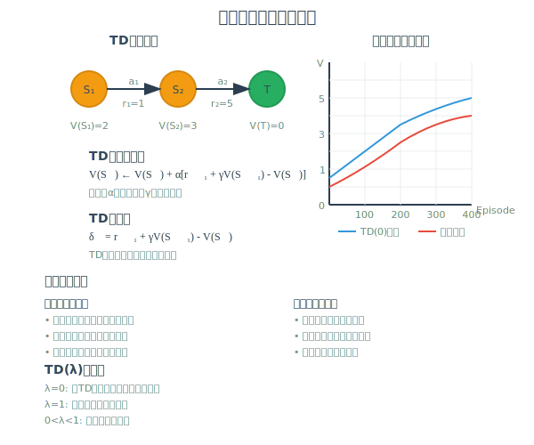

[< 上一页： 6.2. 动态规划算法](chapter6/6.2.dynamic_programming.md)  &nbsp; |  &nbsp;  [下一页： 6.4. 强化学习算法 >](chapter6/6.4.reinforcement_learning.md)

# 6.3. 蒙特卡洛采样
本节介绍蒙特卡洛（Monte Carlo）方法在决策优化和强化学习中的应用。蒙特卡洛方法是一类基于随机采样的数值计算方法，通过大量随机样本来近似求解复杂的数学问题。我们将从经典的圆周率估算问题入手，详细阐述蒙特卡洛方法的基本原理，然后介绍时序差分学习算法，最后通过网格世界最短路径问题演示蒙特卡洛方法在强化学习中的具体应用。

## 6.3.1. 蒙特卡洛采样基础：圆面积的计算
蒙特卡洛方法最初由数学家乌拉姆（Stanislaw Ulam）在曼哈顿计划期间提出，因摩纳哥的蒙特卡洛赌场而得名。该方法的核心思想是通过随机采样来解决确定性问题，特别适用于高维积分、优化问题和概率计算。


圆周率的估算是蒙特卡洛方法的经典应用案例，直观地展示了随机采样的威力。考虑单位正方形 $ [-1,1] \times [-1,1] $ 内接一个单位圆 $ x^2 + y^2 \leq 1 $，两者的面积比为：

$$
\frac{\text{圆面积}}{\text{正方形面积}} = \frac{\pi \times 1^2}{2^2} = \frac{\pi}{4}
$$

**蒙特卡洛估算算法**
基于面积比的几何关系，我们可以设计如下算法：

1. **随机采样**：在正方形 $ [-1,1] \times [-1,1] $ 内均匀随机生成 $ N $ 个点 $ (x_i, y_i) $
2. **几何判断**：统计落在单位圆内的点数 $ M $，即满足 $ x_i^2 + y_i^2 \leq 1 $ 的点数
3. **比例估算**：计算圆周率的近似值：
   $$
   \pi \approx 4 \times \frac{M}{N}
   $$

**理论基础**
蒙特卡洛估算的理论基础来自于**大数定律**和**中心极限定理**：

- **强大数定律**：当 $ N \to \infty $ 时，$ \frac{M}{N} \to \frac{\pi}{4} $ 几乎必然成立
- **收敛速度**：估算误差的标准差为 $ O(1/\sqrt{N}) $，与维数无关
- **置信区间**：基于中心极限定理可以构造置信区间：
  $$
  \pi \in \left[ 4\frac{M}{N} \pm 1.96\sqrt{\frac{4M(N-M)}{N^3}} \right]
  $$

**算法特点分析**
- **维数优势**：收敛速度不依赖于问题维数，适合高维问题
- **简单性**：算法实现简单，易于并行化
- **通用性**：适用于各种复杂几何形状和积分问题
- **收敛慢**：需要大量样本才能获得高精度，计算开销较大

## 6.3.2. 时序差分算法
时序差分（Temporal Difference, TD）学习是蒙特卡洛方法与动态规划的结合，既具有蒙特卡洛方法的采样特性，又具有动态规划的自引导特性。TD学习在强化学习中占据核心地位，是许多现代强化学习算法的基础。



**基本思想**
传统的蒙特卡洛方法需要等待完整回合结束才能更新价值函数，而TD学习可以在每一步之后立即更新。其核心思想是使用当前的价值函数估计来替代未来的实际回报。

**TD(0)算法**
TD(0)是最简单的时序差分算法，其更新规则为：
$$
V(S_t) \leftarrow V(S_t) + \alpha [R_{t+1} + \gamma V(S_{t+1}) - V(S_t)]
$$

其中：
- $ \alpha \in (0,1] $：学习率，控制新信息的影响程度
- $ \gamma \in [0,1) $：折扣因子，平衡即时奖励与未来奖励
- $ \delta_t = R_{t+1} + \gamma V(S_{t+1}) - V(S_t) $：TD误差

**TD误差的解释**
TD误差 $ \delta_t $ 反映了预测与"现实"的差异：
- **正TD误差**：当前状态价值被低估，应该增加
- **负TD误差**：当前状态价值被高估，应该减少
- **零TD误差**：预测完全准确，无需更新

**TD(λ)算法族**
TD(λ)是TD算法的推广，通过引入资格迹（eligibility trace）平衡偏差与方差：

$$
V(s) \leftarrow V(s) + \alpha \delta_t e_t(s)
$$

其中资格迹更新为：
$$
e_t(s) = \begin{cases}
\gamma \lambda e_{t-1}(s) + 1 & \text{如果 } s = S_t \\
\gamma \lambda e_{t-1}(s) & \text{否则}
\end{cases}
$$

参数 $ \lambda $ 控制了算法的特性：
- $ \lambda = 0 $：纯TD学习，只考虑一步前瞻
- $ \lambda = 1 $：等价于蒙特卡洛方法
- $ 0 < \lambda < 1 $：在偏差和方差之间取得平衡

**收敛性质**
TD学习算法具有良好的收敛性质：
- **收敛保证**：在适当条件下，TD(0)收敛到真实价值函数
- **学习率条件**：需要满足 $ \sum_t \alpha_t = \infty $ 且 $ \sum_t \alpha_t^2 < \infty $
- **收敛速度**：通常比蒙特卡洛方法更快，特别是在早期阶段

**与其他方法的比较**
|特性|蒙特卡洛|时序差分|动态规划|
|---|---|---|---|
|需要模型|否|否|是|
|在线学习|否|是|是|
|收敛保证|是|是|是|
|计算复杂度|高|中|低|
|样本效率|低|高|最高|

## 6.3.3. 网格中的最短路径算例
为了演示蒙特卡洛方法在路径规划中的应用，我们考虑与6.2节相同的网格世界问题，但使用蒙特卡洛方法求解。这个对比展示了不同算法在相同问题上的不同特点。


**问题设定重述**
- **状态空间**：$ 5 \times 5 $ 网格，$ S = \{(i,j) | 0 \leq i,j \leq 4\} $
- **动作空间**：$ A = \{\text{上}, \text{下}, \text{左}, \text{右}\} $
- **起始状态**：$ s_0 = (0,0) $
- **目标状态**：$ s_g = (4,4) $
- **奖励函数**：每步移动 $ -1 $，到达目标 $ 0 $，撞墙或碰障碍 $ -1 $（停留原地）

**首次访问蒙特卡洛算法**
该算法通过完整的回合轨迹来学习状态价值函数：

1. **策略初始化**：采用 $ \varepsilon $-贪婪策略，如随机策略或启发式策略
2. **回合生成**：
   ```
   算法 生成回合轨迹(起始状态s₀, 策略π)
   输入: 起始状态s₀, 策略π
   输出: 轨迹τ = [(s₀,a₀,r₀), (s₁,a₁,r₁), ..., (sₜ,aₜ,rₜ)]
   BEGIN
       初始化轨迹 τ ← []
       当前状态 s ← s₀
       WHILE s ≠ 目标状态 DO
           选择动作 a ~ π(·|s)
           执行动作a，观察下一状态s'和奖励r
           τ.添加((s, a, r))
           s ← s'
       END WHILE
       返回 τ
   END
   ```
3. **价值更新**：
   ```
   算法 首次访问价值更新(轨迹τ, 价值函数V, 学习率α, 折扣因子γ)
   输入: 轨迹τ, 价值函数V, 学习率α, 折扣因子γ
   输出: 更新后的价值函数V
   BEGIN
       累积回报 G ← 0
       FOR t = |τ|-1 DOWN TO 0 DO
           G ← γ × G + r_t
           IF s_t 在轨迹中首次出现 THEN
               V(s_t) ← V(s_t) + α × [G - V(s_t)]
           END IF
       END FOR
   END
   ```

**每次访问蒙特卡洛算法**
与首次访问不同，每次访问算法对轨迹中状态的每次出现都进行更新：

$$
V(s) \leftarrow V(s) + \alpha [G_t - V(s)]
$$

其中 $ G_t $ 是从时刻 $ t $ 开始的累积回报。

**算法实现细节**

**1. 探索策略设计**
```
算法 ε-贪婪策略(Q, s, ε)
输入: 动作价值函数Q, 当前状态s, 探索率ε
输出: 选择的动作a
BEGIN
    随机生成 r ∈ [0,1)
    IF r < ε THEN
        返回 随机选择(动作集合A)     // 探索
    ELSE
        返回 argmax{Q(s,a) : a ∈ A}  // 利用
    END IF
END
```

**2. 回报计算**
```
算法 计算累积回报(轨迹τ, 折扣因子γ)
输入: 轨迹τ = [(s₀,a₀,r₀), (s₁,a₁,r₁), ..., (sₜ,aₜ,rₜ)]
输入: 折扣因子γ ∈ [0,1)
输出: 回报序列G = [G₀, G₁, ..., Gₜ]
BEGIN
    初始化 G ← 0, 回报列表 returns ← []
    FOR t = T-1 DOWN TO 0 DO
        G ← γ × G + r(t)
        returns.前插(G)          // 在列表前端插入
    END FOR
    返回 returns
END
```

**3. 价值函数更新**
```
算法 首次访问蒙特卡洛更新(V, 轨迹τ, 回报G, 学习率α)
输入: 价值函数V, 轨迹τ, 回报序列G, 学习率α
输出: 更新后的价值函数V
BEGIN
    初始化 已访问集合 visited ← ∅
    FOR t = 0 TO |τ|-1 DO
        状态 s ← τ[t].state
        IF s ∉ visited THEN        // 首次访问该状态
            V(s) ← V(s) + α × [G[t] - V(s)]
            visited ← visited ∪ {s}
        END IF
    END FOR
END
```

**收敛分析**
蒙特卡洛方法的收敛性基于以下理论保证：

- **无偏估计**：$ E[G_t | S_t = s] = V^{\pi}(s) $
- **方差有界**：在有限MDP中，回报的方差有界
- **收敛定理**：在适当的学习率调度下，$ V(s) \to V^{\pi}(s) $ 几乎必然成立

**性能比较**
与动态规划相比，蒙特卡洛方法具有以下特点：

|方面|动态规划|蒙特卡洛|
|---|---|---|
|计算复杂度|$ O(|\mathcal{S}|^2|\mathcal{A}|) $|$ O(T \cdot L) $|
|内存需求|$ O(|\mathcal{S}|^2|\mathcal{A}|) $|$ O(|\mathcal{S}|) $|
|模型需求|需要完整环境模型|仅需采样能力|
|收敛速度|快（确定性）|慢（随机性）|
|适用场景|小规模已知环境|大规模未知环境|

其中 $ T $ 是回合数，$ L $ 是平均回合长度。

## 6.3.4. 练习

在MicroCity中实现以下蒙特卡洛方法应用：

**案例1：蒙特卡洛π估算**
- 实现基本的蒙特卡洛π估算算法
- 分析不同样本数对估算精度的影响
- 实现并行化版本提高计算效率
- 比较均匀分布与其他分布的采样效果
- 计算收敛速度和置信区间

**案例2：仓储机器人路径学习**
- 构建包含动态障碍物的仓储环境
- 机器人通过蒙特卡洛方法学习最优路径策略
- 实现首次访问和每次访问蒙特卡洛算法
- 比较不同探索策略（ε-贪婪、软max等）的效果
- 分析学习率和折扣因子对收敛的影响

**案例3：配送网络优化**
- 设计一个包含随机延误的配送网络
- 使用蒙特卡洛方法估算不同路线的期望成本
- 实现重要性采样技术提高估算效率
- 结合时序差分学习实现在线路径调整
- 分析算法在环境变化时的适应性

**编程要求**
1. 实现完整的蒙特卡洛学习框架
2. 包含多种探索策略和学习率调度
3. 提供收敛性监控和可视化工具
4. 实现算法性能比较和统计分析
5. 支持大规模并行采样计算
6. 添加实时学习效果展示

**扩展练习**
- 实现蒙特卡洛树搜索（MCTS）算法
- 结合深度网络实现蒙特卡洛强化学习
- 探索变分蒙特卡洛方法
- 实现适应性重要性采样技术
- 研究蒙特卡洛方法在多智能体系统中的应用

**思考问题**
1. 在什么情况下蒙特卡洛方法比动态规划更有优势？
2. 如何选择合适的采样策略以提高算法效率？
3. 时序差分学习与蒙特卡洛方法的本质区别是什么？
4. 如何处理连续状态空间中的蒙特卡洛学习？
5. 在实际应用中如何平衡探索与利用？

[< 上一页： 6.2. 动态规划算法](chapter6/6.2.dynamic_programming.md)  &nbsp; |  &nbsp;  [下一页： 6.4. 强化学习算法 >](chapter6/6.4.reinforcement_learning.md)