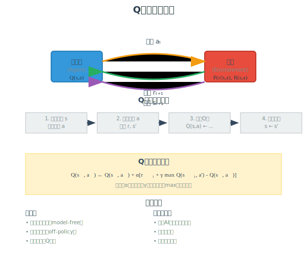
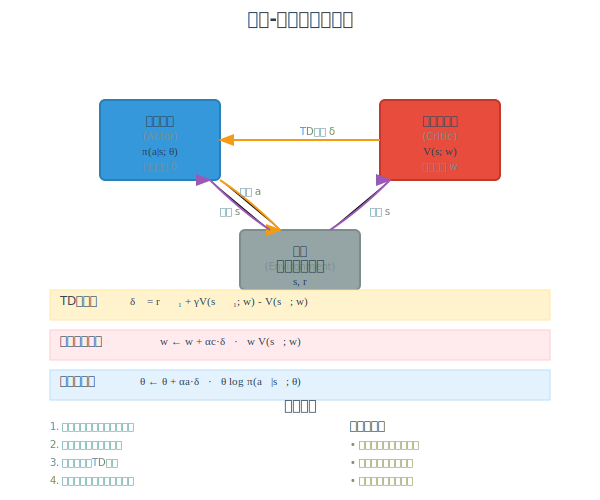
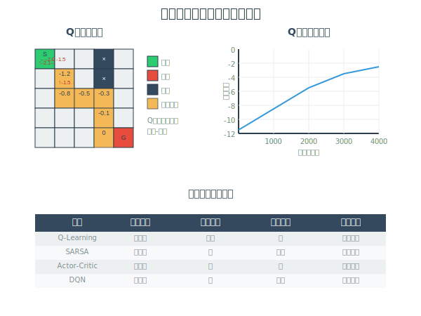

[< 上一页： 6.3. 蒙特卡洛采样](chapter6/6.3.monte_carlo.md)  &nbsp; |  &nbsp;  [下一页： 第7章 机器学习进阶 >](chapter7/introduction.md)

# 6.4. 强化学习进阶
本节介绍强化学习（Reinforcement Learning）的进阶算法和实际应用。强化学习是机器学习的重要分支，通过智能体与环境的交互来学习最优决策策略。我们将详细阐述Q学习算法的原理和实现，介绍演员-评论员方法的架构设计，最后通过网格世界问题对比不同强化学习算法的性能特点。这些算法在智能交通、机器人控制、资源调度等领域有重要应用价值。

## 6.4.1. Q学习算法
Q学习（Q-Learning）是强化学习中最经典的无模型算法之一，由Watkins在1989年提出。该算法通过学习动作价值函数Q(s,a)来寻找最优策略，无需事先了解环境的转移概率和奖励函数，具有很强的实用性。



**马尔可夫决策过程回顾**
Q学习基于马尔可夫决策过程（MDP）框架，其核心要素包括：
- **状态空间** $ \mathcal{S} $：环境的所有可能状态
- **动作空间** $ \mathcal{A} $：每个状态下的可选动作
- **转移概率** $ P(s'|s,a) $：执行动作后的状态转移概率
- **奖励函数** $ R(s,a,s') $：状态转移的即时奖励
- **策略** $ \pi(a|s) $：状态到动作的映射规则

**Q函数定义**
动作价值函数Q^π(s,a)定义为在状态s执行动作a后遵循策略π的期望累积奖励：
$$
Q^{\pi}(s,a) = \mathbb{E}_{\pi}\left[\sum_{t=0}^{\infty} \gamma^t R_{t+1} \Big| S_0=s, A_0=a\right]
$$

最优Q函数满足Bellman最优方程：
$$
Q^*(s,a) = \mathbb{E}[R_{t+1} + \gamma \max_{a'} Q^*(S_{t+1}, a') | S_t=s, A_t=a]
$$

**Q学习更新规则**
Q学习算法采用时序差分方法更新Q值：
$$
Q(s_t, a_t) \leftarrow Q(s_t, a_t) + \alpha [r_{t+1} + \gamma \max_{a'} Q(s_{t+1}, a') - Q(s_t, a_t)]
$$

其中：
- $ \alpha \in (0,1] $：学习率，控制新信息的影响程度
- $ \gamma \in [0,1) $：折扣因子，平衡即时与长期奖励
- $ r_{t+1} + \gamma \max_{a'} Q(s_{t+1}, a') $：目标值
- $ Q(s_t, a_t) $：当前估计值

**算法实现**
```
算法 Q学习算法(环境, 初始状态s₀, 参数α, γ, ε)
输入: 环境Environment, 初始状态s₀, 学习率α, 折扣因子γ, 探索率ε
输出: 最优Q函数Q*
BEGIN
    初始化 Q(s,a) ← 0 对所有 s ∈ S, a ∈ A
    当前状态 s ← s₀
    
    WHILE 未收敛 DO
        // ε-贪婪动作选择
        随机数 r ← 均匀分布[0,1)
        IF r < ε THEN
            动作 a ← 随机选择(A)
        ELSE
            动作 a ← argmax{Q(s,a') : a' ∈ A}
        END IF
        
        // 执行动作并观察结果
        执行动作a，观察奖励r和下一状态s'
        
        // Q值更新
        Q(s,a) ← Q(s,a) + α[r + γ·max{Q(s',a') : a' ∈ A} - Q(s,a)]
        
        // 状态转移
        s ← s'
    END WHILE
    
    返回 Q
END
```

**收敛性分析**
Q学习算法的收敛性由以下定理保证：

**定理（Q学习收敛性）**：在满足以下条件时，Q学习算法以概率1收敛到最优Q函数：
1. **有界奖励**：奖励函数有界
2. **无限探索**：每个状态-动作对被无限次访问
3. **学习率条件**：$ \sum_{t=0}^{\infty} \alpha_t = \infty $ 且 $ \sum_{t=0}^{\infty} \alpha_t^2 < \infty $

**探索与利用平衡**
Q学习面临的核心挑战是平衡探索（exploration）和利用（exploitation）：

- **ε-贪婪策略**：以概率ε随机选择动作，以概率1-ε选择当前最优动作
- **ε衰减策略**：随时间逐渐减小ε值，如 $ \varepsilon_t = \varepsilon_0 \cdot e^{-\lambda t} $
- **Boltzmann探索**：基于Q值的概率分布选择动作：
  $$
  \pi(a|s) = \frac{e^{Q(s,a)/\tau}}{\sum_{a'} e^{Q(s,a')/\tau}}
  $$

**算法特点**
- **无模型**：不需要环境的转移概率和奖励函数
- **离策略**：可以学习与行为策略不同的目标策略
- **简单实用**：算法实现简单，适用性强
- **收敛保证**：在适当条件下保证收敛到最优解

## 6.4.2. 演员-评论员方法
演员-评论员（Actor-Critic）方法结合了策略梯度和价值函数方法的优点，通过两个网络的协同工作实现高效的策略学习。该方法特别适用于连续动作空间和大规模状态空间的问题。



**基本架构**
演员-评论员方法包含两个主要组件：

1. **演员（Actor）**：维护参数化策略 $ \pi(a|s;\theta) $，负责动作选择
2. **评论员（Critic）**：维护价值函数 $ V(s;w) $ 或 $ Q(s,a;w) $，负责策略评估

**策略梯度基础**
演员网络基于策略梯度定理更新参数。对于随机策略 $ \pi(a|s;\theta) $，性能函数的梯度为：
$$
\nabla_{\theta} J(\theta) = \mathbb{E}_{\pi}[\nabla_{\theta} \log \pi(a|s;\theta) \cdot Q^{\pi}(s,a)]
$$

由于真实的Q函数未知，使用评论员网络的估计值 $ Q(s,a;w) $ 替代。

**时序差分误差**
评论员网络通过最小化时序差分误差学习价值函数：
$$
\delta_t = r_{t+1} + \gamma V(s_{t+1};w) - V(s_t;w)
$$

这个TD误差同时用于更新演员和评论员网络。

**参数更新规则**
演员-评论员算法的参数更新包括两个步骤：

1. **评论员更新**：
   $$
   w \leftarrow w + \alpha_c \cdot \delta_t \cdot \nabla_w V(s_t;w)
   $$

2. **演员更新**：
   $$
   \theta \leftarrow \theta + \alpha_a \cdot \delta_t \cdot \nabla_{\theta} \log \pi(a_t|s_t;\theta)
   $$

其中 $ \alpha_c $ 和 $ \alpha_a $ 分别是评论员和演员的学习率。

**算法实现**
```
算法 演员-评论员算法(环境, 初始状态s₀, 参数αₐ, αc, γ)
输入: 环境Environment, 初始状态s₀, 演员学习率αₐ, 评论员学习率αc, 折扣因子γ
输出: 最优策略π*, 价值函数V*
BEGIN
    初始化 策略参数θ ← 随机值
    初始化 价值参数w ← 随机值
    当前状态 s ← s₀
    
    WHILE 未收敛 DO
        // 演员选择动作
        根据策略π(·|s;θ)采样动作a
        
        // 环境交互
        执行动作a，观察奖励r和下一状态s'
        
        // 计算TD误差
        IF s'是终止状态 THEN
            δ ← r - V(s;w)
        ELSE
            δ ← r + γ·V(s';w) - V(s;w)
        END IF
        
        // 更新评论员参数
        w ← w + αc·δ·∇w V(s;w)
        
        // 更新演员参数
        θ ← θ + αₐ·δ·∇θ log π(a|s;θ)
        
        // 状态转移
        s ← s'
    END WHILE
    
    返回 π(·|·;θ), V(·;w)
END
```

**优势函数**
为了减少方差，常用优势函数（Advantage Function）替代Q函数：
$$
A^{\pi}(s,a) = Q^{\pi}(s,a) - V^{\pi}(s)
$$

优势函数可以通过TD误差近似：$ A(s,a) \approx \delta_t $

**算法变种**
- **A2C（Advantage Actor-Critic）**：使用优势函数的同步版本
- **A3C（Asynchronous Advantage Actor-Critic）**：异步并行训练
- **PPO（Proximal Policy Optimization）**：限制策略更新幅度
- **SAC（Soft Actor-Critic）**：基于最大熵的连续控制算法

**算法优势**
- **低方差**：相比纯策略梯度方法方差更小
- **高效率**：相比价值函数方法样本效率更高
- **连续动作**：天然支持连续动作空间
- **在线学习**：可以进行在线增量学习

## 6.4.3. 网格世界强化学习比较
为了直观展示不同强化学习算法的特点，我们在相同的网格世界环境中比较Q学习、SARSA、演员-评论员等算法的性能表现。这种对比分析有助于理解各算法的适用场景和优缺点。



**实验设置**
使用与前面章节相同的 $ 5 \times 5 $ 网格世界：
- **状态空间**：25个离散状态
- **动作空间**：上、下、左、右四个动作
- **奖励设置**：移动-1，到达目标0，撞墙-1
- **折扣因子**：$ \gamma = 0.9 $
- **学习率**：$ \alpha = 0.1 $

**Q学习算法表现**
Q学习作为离策略算法，具有以下特点：

```
算法 网格世界Q学习实现
输入: 网格环境Grid, 回合数episodes, 学习参数α, γ, ε
输出: Q表和学习曲线
BEGIN
    初始化 Q(s,a) ← 0 对所有状态-动作对
    初始化 回报记录 returns ← []
    
    FOR episode = 1 TO episodes DO
        状态 s ← 起始状态(0,0)
        回合回报 episode_return ← 0
        步数 steps ← 0
        
        WHILE s ≠ 目标状态 AND steps < max_steps DO
            // ε-贪婪动作选择
            IF 随机数() < ε THEN
                动作 a ← 随机选择(动作空间)
            ELSE
                动作 a ← argmax{Q(s,a') : a' ∈ 动作空间}
            END IF
            
            // 执行动作
            下一状态 s', 奖励 r ← 环境.step(s, a)
            
            // Q值更新
            Q(s,a) ← Q(s,a) + α[r + γ·max{Q(s',a') : a'} - Q(s,a)]
            
            // 更新统计
            episode_return ← episode_return + r
            s ← s'
            steps ← steps + 1
        END WHILE
        
        returns.append(episode_return)
        
        // 衰减探索率
        ε ← max(ε_min, ε × decay_rate)
    END FOR
    
    返回 Q, returns
END
```

**SARSA算法对比**
SARSA（State-Action-Reward-State-Action）是在策略算法，其更新规则为：
$$
Q(s_t, a_t) \leftarrow Q(s_t, a_t) + \alpha [r_{t+1} + \gamma Q(s_{t+1}, a_{t+1}) - Q(s_t, a_t)]
$$

关键差异：
- **Q学习**：使用 $ \max_{a'} Q(s_{t+1}, a') $（最优动作）
- **SARSA**：使用 $ Q(s_{t+1}, a_{t+1}) $（实际执行的动作）

**性能比较分析**

| 算法 | 收敛速度 | 最终性能 | 探索安全性 | 样本效率 | 适用场景 |
|------|----------|----------|------------|----------|----------|
| Q学习 | 快 | 最优 | 较低 | 高 | 仿真环境 |
| SARSA | 中等 | 接近最优 | 高 | 中等 | 实际部署 |
| 演员-评论员 | 快 | 很好 | 中等 | 很高 | 连续控制 |
| 蒙特卡洛 | 慢 | 最优 | 高 | 低 | 简单环境 |

**实验结果分析**

1. **收敛性能**：
   - Q学习通常收敛到真正的最优策略
   - SARSA考虑探索风险，策略更保守
   - 演员-评论员在连续动作空间表现最佳

2. **样本效率**：
   - 演员-评论员 > Q学习 > SARSA > 蒙特卡洛
   - 时序差分方法普遍优于蒙特卡洛方法

3. **稳定性**：
   - SARSA最稳定，适合实际部署
   - Q学习可能过度探索危险区域
   - 演员-评论员需要调参，但效果最好

**算法选择指导**
- **离散动作 + 仿真环境**：选择Q学习
- **离散动作 + 实际部署**：选择SARSA
- **连续动作空间**：选择演员-评论员
- **简单问题 + 完整回合**：选择蒙特卡洛

## 6.4.4. 练习

在MicroCity中实现以下强化学习算法应用：

**案例1：智能交通信号控制**
- 构建包含多个交叉口的交通网络环境
- 状态包括各方向车流量、等待时间等信息
- 动作为各信号灯的相位选择和时长设置
- 使用Q学习或演员-评论员算法优化信号控制策略
- 比较不同算法在减少交通拥堵方面的效果
- 分析算法在交通流量变化时的适应性

**案例2：仓储机器人协同调度**
- 设计多机器人仓储环境，包含货架、订单、充电站
- 状态空间包括机器人位置、电量、任务队列等
- 动作空间包括移动方向、任务分配、充电决策
- 实现多智能体强化学习算法（如MADDPG）
- 优化整体仓储效率和机器人协同性
- 处理机器人故障和动态任务调整

**案例3：云资源动态调度**
- 构建云计算资源调度模拟环境
- 状态包括CPU、内存使用率、任务优先级、SLA要求
- 动作为资源分配策略和任务调度决策
- 使用深度强化学习算法（如DQN、A3C）处理高维状态
- 优化资源利用率和任务完成时间
- 考虑成本控制和服务质量保证

**编程要求**
1. 实现完整的强化学习算法框架（Q学习、SARSA、Actor-Critic）
2. 支持离散和连续动作空间
3. 包含多种探索策略和学习率调度机制
4. 提供实时学习过程可视化和性能监控
5. 实现经验回放和目标网络等优化技术
6. 支持多智能体环境和分布式训练

**扩展练习**
- 实现深度Q网络（DQN）和其改进版本（Double DQN, Dueling DQN）
- 探索策略梯度方法（REINFORCE, A2C, PPO）
- 研究模型预测控制与强化学习的结合
- 实现元学习和迁移学习技术
- 开发强化学习算法的鲁棒性和安全性保证机制

**思考问题**
1. 在什么情况下应该选择在策略vs离策略算法？
2. 如何平衡探索与利用以提高学习效率？
3. 连续动作空间的强化学习有哪些特殊挑战？
4. 如何处理部分可观测环境中的强化学习问题？
5. 多智能体强化学习中如何解决非平稳性问题？
6. 强化学习算法在实际部署时需要考虑哪些安全性问题？

[< 上一页： 6.3. 蒙特卡洛采样](chapter6/6.3.monte_carlo.md)  &nbsp; |  &nbsp;  [下一页： 第7章 机器学习进阶 >](chapter7/introduction.md)
